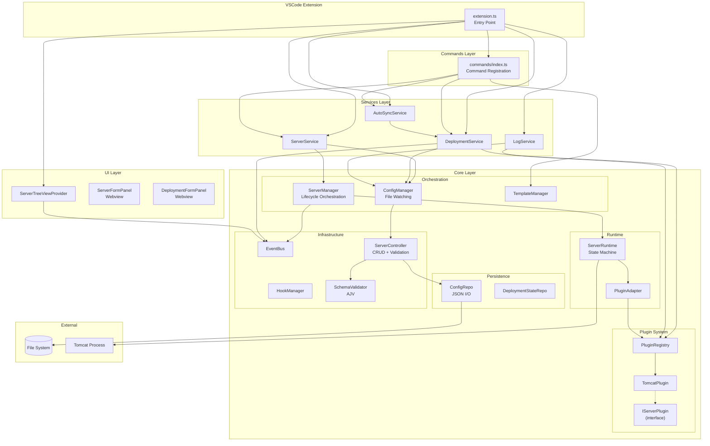
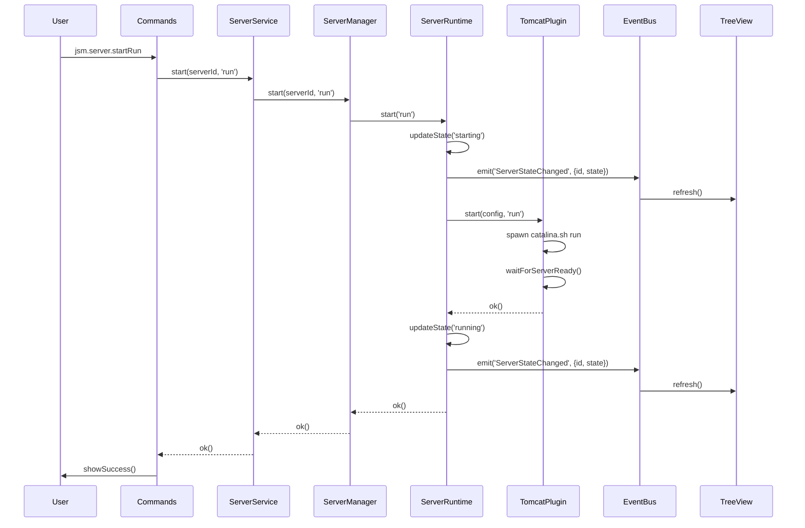

# PROJECT_DOSSIER.md — Java Server Manager (JSM)

> **Generato:** 2025-12-23  
> **Autore:** Staff Engineer / Software Architect Analysis  
> **Repo:** `java-server-manager`

---

## Table of Contents

1. [Executive Summary](#1-executive-summary)
2. [Current Status Snapshot](#2-current-status-snapshot)
3. [How to Run](#3-how-to-run)
4. [Architecture Blueprint](#4-architecture-blueprint)
5. [Codebase Map](#5-codebase-map)
6. [Key Flows](#6-key-flows)
7. [Interfaces](#7-interfaces)
8. [Data Layer](#8-data-layer)
9. [Config & Environments](#9-config--environments)
10. [Error Handling & Observability](#10-error-handling--observability)
11. [Security Notes](#11-security-notes)
12. [Performance & Scalability Notes](#12-performance--scalability-notes)
13. [Tests & CI/CD](#13-tests--cicd)
14. [Technical Debt & Risks](#14-technical-debt--risks)
15. [Roadmap di Miglioramento](#15-roadmap-di-miglioramento)
16. [Appendix](#16-appendix)

---

## 1. Executive Summary

### Cosa è
**Java Server Manager (JSM)** è un'estensione VSCode progettata per gestire server applicativi Java (Tomcat, Jetty, JBoss, etc.) direttamente dall'IDE. È presentata come alternativa moderna a Red Hat Server Connector (RSP UI).

### Caratteristiche principali
- Gestione lifecycle server (start/stop/restart con modalità run/debug)
- Deploy/undeploy di WAR e directory exploded
- Auto-sync per hot-reload durante lo sviluppo
- Tree view sidebar per visualizzazione gerarchica server/deployment
- Sistema di template per configurazioni server predefinite
- Supporto JPDA debug con auto-attach VSCode

### Utenti target
Sviluppatori Java Enterprise che lavorano con application server in ambiente VSCode.

### Stato attuale
**MVP funzionale ma incompleto**: Solo Tomcat è implementato. Test non presenti (infrastruttura sì, test suite no). CI/CD assente.

---

## 2. Current Status Snapshot

| Area | Stato | Note |
|------|-------|------|
| **Build** | ✅ Fatto | `npm run compile`, `npm run package` funzionanti |
| **Runtime** | ⚠️ Parziale | Solo Tomcat implementato, altri server dichiarati ma assenti |
| **Server Lifecycle** | ✅ Fatto | Start/stop/restart con run/debug mode |
| **Deployment** | ✅ Fatto | WAR + exploded, full/incremental |
| **Auto-Sync** | ✅ Fatto | File watcher con debounce |
| **Template System** | ✅ Fatto | CRUD templates globali |
| **Tree View UI** | ✅ Fatto | Refresh automatico su eventi |
| **Webview Forms** | ✅ Fatto | Form per server e deployment |
| **Unit Tests** | ❌ Mancante | Infrastruttura presente, no test |
| **Integration Tests** | ❌ Mancante | |
| **E2E Tests** | ❌ Mancante | |
| **CI/CD Pipeline** | ❌ Mancante | No `.github/workflows` |
| **Logging** | ⚠️ Parziale | Logger custom, no structured logging |
| **Metrics/Tracing** | ❌ Mancante | |
| **Jetty Plugin** | ❌ Mancante | Dichiarato in `ServerType`, non implementato |
| **WildFly Plugin** | ❌ Mancante | |
| **WebLogic Plugin** | ❌ Mancante | |

---

## 3. How to Run

### Prerequisites
- **Node.js**: ≥ 18.x (non specificato esplicitamente, dedotto da dipendenze)
- **VSCode**: ≥ 1.100.0 (`package.json` L7)
- **Java JDK**: ≥ 8 (documentato in `README.md` L34)
- **Tomcat**: Installazione locale per testing

### Comandi principali

```bash
# Installazione dipendenze
npm install

# Compilazione (type-check + lint + esbuild)
npm run compile          # package.json L275

# Watch mode per sviluppo
npm run watch            # package.json L276

# Package produzione
npm run package          # package.json L279

# Lint
npm run lint             # package.json L284

# Type check
npm run check-types      # package.json L283

# Test (infrastruttura pronta, test assenti)
npm run test             # package.json L285
```

### Avvio in development
1. Aprire repo in VSCode
2. Premere `F5` per lanciare Extension Development Host
3. Nel nuovo VSCode, aprire un workspace
4. Cercare "Java Server Manager" nella sidebar

> **Fonte file:** [`package.json`](file:///Users/federicofilippi/Desktop/MyProj/java-server-manager/package.json) L273-286

---

## 4. Architecture Blueprint

### Diagramma Componenti



### Flusso Dati / Stato



### Pattern architetturali rilevati

| Pattern | Dove | Note |
|---------|------|------|
| **Singleton** | `ConfigManager`, `ServerManager`, `PluginRegistry`, `ConfigRepo`, etc. | Tutti i manager core usano singleton |
| **Result Type** | `src/core/utils/result.ts` | `Result<T, E>` con `ok()` / `err()` per error handling funzionale |
| **Event Bus** | `src/core/EventBus.ts` | Pub/sub per coordinamento stato |
| **Plugin Architecture** | `src/core/server/plugins/` | Interface + Registry + implementations |
| **Repository Pattern** | `ConfigRepo`, `DeploymentStateRepo` | Separazione I/O da business logic |
| **Facade** | `ServerService`, `DeploymentService` | Orchestrano sottosistemi complessi |
| **State Machine** | `ServerRuntime` | Stati: stopped → starting → running → stopping → stopped/error |

---

## 5. Codebase Map

```
java-server-manager/
├── src/
│   ├── extension.ts              # Entry point VSCode, activate/deactivate
│   ├── extension.new.ts          # DEAD CODE? Versione alternativa non usata
│   ├── constants.ts              # Costanti globali
│   │
│   ├── commands/
│   │   └── index.ts (864 lines)  # Registrazione TUTTI i comandi VSCode
│   │
│   ├── services/                 # Facade layer - orchestrazione
│   │   ├── ServerService.ts      # Lifecycle server, facade su ServerManager
│   │   ├── DeploymentService.ts  # CRUD deploy + publish/undeploy
│   │   ├── AutoSyncService.ts    # File watcher per hot-reload
│   │   └── LogService.ts         # Accesso log server
│   │
│   ├── core/
│   │   ├── EventBus.ts           # Pub/sub events
│   │   │
│   │   ├── config/
│   │   │   ├── ConfigManager.ts  # File watching + CRUD delegation
│   │   │   ├── index.ts
│   │   │   └── schema/           # JSON Schema per validazione
│   │   │
│   │   ├── controllers/
│   │   │   └── ServerController.ts # CRUD + validation (business rules)
│   │   │
│   │   ├── server/
│   │   │   ├── ServerManager.ts  # Lifecycle orchestration
│   │   │   ├── ServerRuntime.ts  # State machine singolo server
│   │   │   ├── PluginAdapter.ts  # Bridge verso plugin
│   │   │   └── plugins/
│   │   │       ├── index.ts
│   │   │       ├── interfaces/
│   │   │       │   └── IServerPlugin.ts (41 lines) # Contract minimale
│   │   │       ├── registry/
│   │   │       │   └── PluginRegistry.ts # Factory + detection
│   │   │       └── implementations/
│   │   │           └── TomcatPlugin.ts (518 lines) # SOLO IMPL ESISTENTE
│   │   │
│   │   ├── persistence/
│   │   │   ├── ConfigRepo.ts     # JSON file I/O + Map cache
│   │   │   └── DeploymentStateRepo.ts # Runtime state persistence
│   │   │
│   │   ├── validation/
│   │   │   └── SchemaValidator.ts # AJV JSON Schema validation
│   │   │
│   │   ├── templates/
│   │   │   └── TemplateManager.ts # CRUD template globali
│   │   │
│   │   ├── hooks/
│   │   │   └── HookManager.ts    # Pre/post hook execution
│   │   │
│   │   ├── debug/
│   │   │   └── DebugManager.ts   # JPDA debug port management
│   │   │
│   │   ├── pid/
│   │   │   └── PidManager.ts     # Process ID tracking
│   │   │
│   │   ├── errors/
│   │   │   ├── codes.ts (87 lines) # ErrorCode enum completo
│   │   │   └── JsmError.ts       # Custom error class
│   │   │
│   │   ├── types/
│   │   │   ├── domain.ts         # ServerConfig, DeploymentConfig, etc.
│   │   │   └── runtime.ts        # ServerStartMode, RuntimeInfo
│   │   │
│   │   ├── utils/
│   │   │   ├── FileUtils.ts
│   │   │   ├── logger.ts         # Logger con child loggers
│   │   │   └── result.ts         # Result<T, E> type
│   │   │
│   │   └── constants/
│   │       └── TreeViewConstants.ts # Context value mappings
│   │
│   ├── ui/
│   │   ├── views/
│   │   │   └── ServerTreeViewProvider.ts # TreeDataProvider sidebar
│   │   └── webviews/
│   │       ├── ServerFormPanel.ts   # Form creazione/modifica server
│   │       └── DeploymentFormPanel.ts
│   │
│   └── test/
│       └── runTest.ts            # Stub per test runner (no test suite)
│
├── dist/                         # Output esbuild (produzione)
├── out/                          # Output tsc (sviluppo)
├── package.json                  # Manifest + scripts + contributes
├── tsconfig.json                 # TypeScript config (ES2022, ESNext modules)
├── esbuild.js                    # Build script
├── eslint.config.mjs             # ESLint flat config
├── README.md                     # Documentazione utente
├── CHANGELOG.md                  # Release notes
└── PHASE2_MIGRATION_COMPLETED.md # Empty file (placeholder?)
```

### Entry Points

| File | Ruolo |
|------|-------|
| [`src/extension.ts`](file:///Users/federicofilippi/Desktop/MyProj/java-server-manager/src/extension.ts) | Entry point VSCode extension |
| [`package.json`](file:///Users/federicofilippi/Desktop/MyProj/java-server-manager/package.json) → `main: "./dist/extension.js"` | Bundle produzione |

### Moduli Core

| Modulo | File | Responsabilità |
|--------|------|----------------|
| **ServerManager** | [`src/core/server/ServerManager.ts`](file:///Users/federicofilippi/Desktop/MyProj/java-server-manager/src/core/server/ServerManager.ts) | Orchestrazione lifecycle, registry runtime |
| **ConfigManager** | [`src/core/config/ConfigManager.ts`](file:///Users/federicofilippi/Desktop/MyProj/java-server-manager/src/core/config/ConfigManager.ts) | File watching, CRUD delegation |
| **PluginRegistry** | [`src/core/server/plugins/registry/PluginRegistry.ts`](file:///Users/federicofilippi/Desktop/MyProj/java-server-manager/src/core/server/plugins/registry/PluginRegistry.ts) | Factory plugin, detection |
| **TomcatPlugin** | [`src/core/server/plugins/implementations/TomcatPlugin.ts`](file:///Users/federicofilippi/Desktop/MyProj/java-server-manager/src/core/server/plugins/implementations/TomcatPlugin.ts) | Unica implementazione server |

### Dead/Unused Code

| File | Motivo |
|------|--------|
| `src/extension.new.ts` | **UNKNOWN** — File alternativo, probabilmente dead code da rimuovere |
| `PHASE2_MIGRATION_COMPLETED.md` | File vuoto, placeholder dimenticato |

---

## 6. Key Flows

### 6.1 Happy Path: Start Server in Debug Mode

```
User → Command "jsm.server.startDebug"
  └── commands/index.ts:99 → registerServerCommands()
      └── ServerService.start(id, 'debug')
          └── ServerService.ts:171-209
              ├── ConfigManager.getServer(id) → config
              ├── ServerManager.start(id, 'debug', debugPort)
              │   └── ServerRuntime.start('debug', port)
              │       ├── updateState('starting')
              │       ├── PluginAdapter.start(config, 'debug', port)
              │       │   └── TomcatPlugin.start()
              │       │       ├── buildEnvironment() con JPDA_OPTS
              │       │       ├── spawn('catalina.sh', ['jpda', 'run'])
              │       │       └── waitForServerReady() → port check
              │       └── updateState('running')
              └── DebugManager.attachDebugger(port)
                  └── vscode.debug.startDebugging()
```

**File coinvolti:**
- [`src/commands/index.ts`](file:///Users/federicofilippi/Desktop/MyProj/java-server-manager/src/commands/index.ts) L99-113
- [`src/services/ServerService.ts`](file:///Users/federicofilippi/Desktop/MyProj/java-server-manager/src/services/ServerService.ts) L171-209
- [`src/core/server/plugins/implementations/TomcatPlugin.ts`](file:///Users/federicofilippi/Desktop/MyProj/java-server-manager/src/core/server/plugins/implementations/TomcatPlugin.ts) L28-72

### 6.2 Deploy WAR Application

```
User → Command "jsm.deployment.forceDeploy"
  └── DeploymentService.publish(serverId, deploymentId)
      └── DeploymentService.ts:104-138
          ├── getServerConfig(serverId)
          ├── getDeployment(serverId, deploymentId)
          ├── validateDeployment(deployment)
          ├── pluginRegistry.get(serverType)
          ├── plugin.deploy(serverConfig, deployment)
          │   └── TomcatPlugin.deploy()
          │       ├── SE WAR: fs.copyFile(source, webapps/name.war)
          │       └── SE exploded: copyDirectory(source, webapps/name)
          └── updateDeploymentState(serverId, deploymentId, 'synced')
```

### 6.3 Edge Case: Server Already Running

```
ServerService.start(id, 'run')
  └── ServerManager.getState(id) → 'running'
      └── return err(SERVER_ALREADY_RUNNING)
```

Gestito in [`src/core/server/ServerRuntime.ts`](file:///Users/federicofilippi/Desktop/MyProj/java-server-manager/src/core/server/ServerRuntime.ts) L57-63.

### 6.4 Edge Case: Invalid Tomcat Installation

```
ServerService.createFromUserInput(config)
  └── TomcatPlugin.detect(serverHome)
      └── TomcatPlugin.ts:257-279
          ├── Check: bin/catalina.sh exists?
          ├── Check: conf/ directory exists?
          ├── Check: lib/catalina.jar exists?
          └── return err(INSTALLATION_VALIDATION_ERROR) se manca qualcosa
```

### 6.5 Edge Case: Config File Changed Externally

```
FileSystemWatcher.onDidChange
  └── ConfigManager.debouncedFileChanged()
      └── ConfigManager.ts:107-132
          ├── debounce 500ms
          ├── ConfigRepo.load()
          └── EventBus.emit('ConfigChanged', {source: 'file', servers})
              └── ServerTreeViewProvider.refresh()
```

---

## 7. Interfaces

### 7.1 VSCode Commands (API Interna)

| Command ID | Descrizione | Handler |
|------------|-------------|---------|
| `jsm.server.add` | Add server (da template) | [`showAddServerMenu()`](file:///Users/federicofilippi/Desktop/MyProj/java-server-manager/src/commands/index.ts#L509) |
| `jsm.server.startRun` | Start in run mode | [`commands/index.ts`](file:///Users/federicofilippi/Desktop/MyProj/java-server-manager/src/commands/index.ts) L83 |
| `jsm.server.startDebug` | Start in debug mode | L99 |
| `jsm.server.stop` | Stop server | L115 |
| `jsm.server.restartRun` | Restart run | L131 |
| `jsm.server.restartDebug` | Restart debug | L147 |
| `jsm.server.edit` | Edit server config | L163 |
| `jsm.server.delete` | Delete server | L190 |
| `jsm.server.openDir` | Open server dir in OS | L216 |
| `jsm.server.copyInfo` | Copy server info | L231 |
| `jsm.server.deployChanges` | Incremental deploy | L251 |
| `jsm.server.fullRedeploy` | Full redeploy | L277 |
| `jsm.server.viewLogs` | View server logs | L310 |
| `jsm.deployment.add` | Add deployment | L347 |
| `jsm.deployment.edit` | Edit deployment | L375 |
| `jsm.deployment.remove` | Remove deployment | L405 |
| `jsm.deployment.forceDeploy` | Force deploy | L431 |
| `jsm.deployment.undeploySoft` | Soft undeploy | L447 |
| `jsm.deployment.toggleAutosync` | Toggle auto-sync | L463 |
| `jsm.templates.manage` | Manage templates | L487 |
| `jsm.treeview.refresh` | Refresh tree | L326 |

**Fonte:** [`package.json`](file:///Users/federicofilippi/Desktop/MyProj/java-server-manager/package.json) L16-121 (contributes.commands)

### 7.2 Context Menus

Definiti in [`package.json`](file:///Users/federicofilippi/Desktop/MyProj/java-server-manager/package.json) L141-251.

Context values usati:
- `server-stopped`, `server-running`, `server-starting`, `server-stopping`, `server-error`
- `deployment`

### 7.3 Plugin Interface

```typescript
// src/core/server/plugins/interfaces/IServerPlugin.ts
export interface IServerPlugin {
  readonly type: string;
  readonly name: string;

  // Lifecycle
  start(config: ServerConfig, mode: ServerStartMode, debugPort?: number): Promise<Result<void, JsmError>>;
  stop(config: ServerConfig): Promise<Result<void, JsmError>>;
  restart(config: ServerConfig, mode: ServerStartMode, debugPort?: number): Promise<Result<void, JsmError>>;

  // Status
  getStatus(config: ServerConfig): Promise<Result<ServerState, JsmError>>;
  healthCheck(config: ServerConfig): Promise<Result<boolean, JsmError>>;

  // Deployment
  deploy(config: ServerConfig, deployment: DeploymentConfig): Promise<Result<void, JsmError>>;
  undeploy(config: ServerConfig, deploymentId: string): Promise<Result<void, JsmError>>;
  deployIncremental?(config: ServerConfig, deployment: DeploymentConfig): Promise<Result<void, JsmError>>;

  // Config
  getDefaultConfig(): Partial<ServerConfig>;

  // Detection
  detect(serverHome: string): Promise<Result<boolean, JsmError>>;
  dispose(): Promise<void>;
}
```

**Fonte:** [`src/core/server/plugins/interfaces/IServerPlugin.ts`](file:///Users/federicofilippi/Desktop/MyProj/java-server-manager/src/core/server/plugins/interfaces/IServerPlugin.ts)

### 7.4 Event Types

```typescript
// src/core/EventBus.ts (dedotto dal codice)
type EventKey =
  | 'WorkspaceLoaded'
  | 'ServerAdded'
  | 'ServerUpdated'
  | 'ServerDeleted'
  | 'ServerStateChanged'
  | 'DeploymentAdded'
  | 'DeploymentRemoved'
  | 'DeploymentStateChanged'
  | 'ConfigChanged';
```

---

## 8. Data Layer

### 8.1 Persistence Format

Configurazione salvata in: `.vscode/servers.json` (workspace-local)

```json
{
  "servers": [
    {
      "id": "uuid",
      "name": "Dev Tomcat",
      "javaHome": "/path/to/jdk",
      "serverHome": "/path/to/tomcat",
      "host": "localhost",
      "port": 8080,
      "debug": {
        "port": 5005,
        "vmArgs": "-Xdebug ...",
        "attachDelay": 1000
      },
      "autoSync": true,
      "envVars": {"CATALINA_OPTS": "..."},
      "vmArgs": "-Xmx1g",
      "deployments": [
        {
          "id": "uuid",
          "sourcePath": "./target/app.war",
          "deployName": "app",
          "type": "war",
          "ignoreGlobs": ["*.tmp"]
        }
      ]
    }
  ]
}
```

**Schema JSON:** [`src/core/config/schema/jsm.server.schema.json`](file:///Users/federicofilippi/Desktop/MyProj/java-server-manager/src/core/config/schema/jsm.server.schema.json)

### 8.2 Runtime State (Separata)

`DeploymentRuntimeState` salvato in VSCode extension storage (non in servers.json):

```typescript
interface DeploymentRuntimeState {
  deploymentId: string;
  serverId: string;
  state: 'undeployed' | 'deploying' | 'synced' | 'error';
  error?: string;
  lastUpdated: number; // timestamp
}
```

### 8.3 Repository Pattern

| Repository | File | Caching |
|------------|------|---------|
| `ConfigRepo` | [`src/core/persistence/ConfigRepo.ts`](file:///Users/federicofilippi/Desktop/MyProj/java-server-manager/src/core/persistence/ConfigRepo.ts) | `Map<id, ServerConfig>` per O(1) lookup |
| `DeploymentStateRepo` | [`src/core/persistence/DeploymentStateRepo.ts`](file:///Users/federicofilippi/Desktop/MyProj/java-server-manager/src/core/persistence/DeploymentStateRepo.ts) | **UNKNOWN** — da verificare implementazione |

### 8.4 Schema Validation

Usa **AJV** (Another JSON Validator) con formats plugin.

```typescript
// src/core/validation/SchemaValidator.ts
import Ajv from 'ajv';
import addFormats from 'ajv-formats';
```

La validazione è triggerata da `ServerController.validateOnly()` prima di ogni CRUD.

### 8.5 Migrazioni

❌ **MANCANTE** — Non esiste un sistema di migrazione schema. Cambiamenti breaking allo schema potrebbero corrompere `servers.json` esistenti senza warning.

---

## 9. Config & Environments

### 9.1 Variabili d'Ambiente (Runtime)

| Variabile | Dove usata | Default | Impatto |
|-----------|------------|---------|---------|
| `JAVA_HOME` | `TomcatPlugin.buildEnvironment()` | `config.javaHome` | Path a JDK |
| `CATALINA_HOME` | `TomcatPlugin.buildEnvironment()` | `config.serverHome` | Path a Tomcat |
| `CATALINA_OPTS` | `TomcatPlugin.buildEnvironment()` | `config.envVars.CATALINA_OPTS` | JVM args |
| `JPDA_OPTS` | `TomcatPlugin.buildEnvironment()` | Generato automaticamente | Debug config |
| `JPDA_ADDRESS` | `TomcatPlugin.buildEnvironment()` | `*:${debugPort}` | Debug port |
| `JPDA_TRANSPORT` | `TomcatPlugin.buildEnvironment()` | `dt_socket` | Debug transport |

**Fonte:** [`TomcatPlugin.ts`](file:///Users/federicofilippi/Desktop/MyProj/java-server-manager/src/core/server/plugins/implementations/TomcatPlugin.ts) L358-383

### 9.2 Config Files

| File | Scopo |
|------|-------|
| `.vscode/servers.json` | Configurazione server (workspace) |
| `~/.vscode/globalStorage/.../templates.json` | Template globali utente |

### 9.3 Feature Flags

❌ **MANCANTI** — Non esiste un sistema di feature flags.

### 9.4 Ambienti (Dev/Stage/Prod)

❌ **NON DEDUCIBILI** — Non c'è separazione esplicita tra ambienti. L'estensione è designed per sviluppo locale.

---

## 10. Error Handling & Observability

### 10.1 Error Model

```typescript
// src/core/errors/JsmError.ts
class JsmError extends Error {
  constructor(
    public readonly code: ErrorCode,
    message: string,
    public readonly cause?: unknown
  ) {
    super(message);
  }
}
```

**Error codes completi:** [`src/core/errors/codes.ts`](file:///Users/federicofilippi/Desktop/MyProj/java-server-manager/src/core/errors/codes.ts) (87 lines, 40+ error codes categorizzati)

### 10.2 Result Type Pattern

```typescript
// src/core/utils/result.ts
type Result<T, E> = { ok: true; value: T } | { ok: false; error: E };
function ok<T>(value: T): Result<T, never>;
function err<E>(error: E): Result<never, E>;
```

Pattern usato **ovunque** — tutte le operazioni async ritornano `Result<T, JsmError>`.

### 10.3 Logging

```typescript
// src/core/utils/logger.ts
class Logger {
  static getInstance(): Logger;
  createChild(name: string): Logger;
  info(msg: string, ...args: any[]): void;
  error(msg: string, error?: unknown): void;
  debug(msg: string, ...args: any[]): void;
  warn(msg: string, ...args: any[]): void;
}
```

Output a: `console.log` + Output Channel "Java Server Manager".

### 10.4 Osservabilità

| Aspetto | Stato |
|---------|-------|
| **Structured Logging** | ❌ No (plain text) |
| **Metrics** | ❌ Mancante |
| **Tracing** | ❌ Mancante |
| **Correlation IDs** | ❌ Mancante |
| **Error Aggregation** | ❌ Mancante |

---

## 11. Security Notes

### 11.1 Punti Critici

| Rischio | Severità | Dettagli |
|---------|----------|----------|
| **Path Injection** | 🔴 High | `serverHome`, `javaHome`, `sourcePath` non sono sanitizzati. Un config maligno potrebbe eseguire comandi arbitrari |
| **Command Injection** | 🔴 High | `spawn()` in TomcatPlugin usa path da config senza escaping |
| **No Input Validation Beyond Schema** | 🟡 Medium | Schema valida struttura, ma non semantica (es: path existance) |
| **Secrets in Config** | 🟡 Medium | Passwords in envVars sono in plaintext su disco |
| **Debug Port Exposure** | 🟡 Medium | JPDA su `*:port` espone debugger su tutte le interfacce |

### 11.2 Miglioramenti Consigliati

1. **Path Sanitization**: Risolvere e validare tutti i path prima dell'uso
2. **Debug Bind Address**: Usare `localhost:port` invece di `*:port` di default
3. **Secrets Management**: Integrazione con VSCode Secret Storage per credentials sensibili
4. **Sandboxing**: Considerare l'uso di container per isolamento processi

---

## 12. Performance & Scalability Notes

### 12.1 Colli di Bottiglia Sospetti

| Area | Problema | Impatto |
|------|----------|---------|
| **ConfigRepo.save()** | Serializza TUTTI i server ogni volta | O(n) write per ogni modifica |
| **TreeView Refresh** | Chiama `getState()` per ogni server | N chiamate sync per N server |
| **No Connection Pooling** | Health check crea nuova connessione ogni volta | Overhead rete |
| **Singleton Event Bus** | Tutti gli eventi transitano da un punto | Potenziale bottleneck con molti listener |

### 12.2 Proposte di Ottimizzazione

| Proposta | Effort | Impatto |
|----------|--------|---------|
| Incremental save (diff-based) | Medium | Riduce I/O |
| Lazy state fetch in TreeView | Quick | Riduce latenza UI |
| Cache HTTP health check | Quick | Riduce network calls |
| Batch event emission | Medium | Riduce refresh storms |

### 12.3 Scalabilità

**Non un problema reale**: Un utente tipico ha 1-5 server. L'architettura è adeguata per questo use case.

---

## 13. Tests & CI/CD

### 13.1 Test Infrastructure

```
src/test/
└── runTest.ts          # Test runner entry point
    └── Uses @vscode/test-electron
    └── Cerca suite in ./suite/index  ← NON ESISTE
```

**Stato: ❌ NESSUN TEST PRESENTE**

Infrastruttura pronta ma nessuna test suite implementata.

### 13.2 Test Commands

```bash
npm run pretest    # Compila tests + extension + lint
npm run test       # Esegue test (fallisce: no suite)
```

> **Fonte:** [`package.json`](file:///Users/federicofilippi/Desktop/MyProj/java-server-manager/package.json) L282, L285

### 13.3 Coverage

❌ **NON CONFIGURATA** — Nessun coverage tool integrato.

### 13.4 CI/CD Pipeline

❌ **ASSENTE** — Non esiste `.github/workflows/` o equivalente.

### 13.5 Dipendenze Test (installate ma non usate)

- `mocha` ^11.5.0
- `sinon` ^20.0.0
- `vitest` ^3.2.1
- `@types/mocha`, `@types/sinon`
- `@vscode/test-cli` ^0.0.10
- `@vscode/test-electron` ^2.5.2

---

## 14. Technical Debt & Risks

### Top 10 Issues

| # | Issue | Gravità | Perché | File/Funzione |
|---|-------|---------|--------|---------------|
| 1 | **No tests** | 🔴 High | Zero coverage, regressioni invisibili | `src/test/` |
| 2 | **Solo Tomcat implementato** | 🔴 High | Jetty/JBoss/WebLogic dichiarati ma assenti | `PluginRegistry.registerDefaultPlugins()` |
| 3 | **No CI/CD** | 🔴 High | Nessuna validazione automatica PR | `.github/workflows/` |
| 4 | **Path injection risk** | 🔴 High | Comandi eseguiti senza sanitizzazione | `TomcatPlugin.start()` |
| 5 | **extension.new.ts** | 🟡 Medium | Dead code che inquina repo | `src/extension.new.ts` |
| 6 | **No schema migrations** | 🟡 Medium | Breaking changes non gestiti | `ConfigRepo` |
| 7 | **Singleton overuse** | 🟡 Medium | Testing più difficile, stato globale | Tutti i manager |
| 8 | **Debug port exposition** | 🟡 Medium | `*:port` invece di `localhost:port` | `TomcatPlugin.buildEnvironment()` |
| 9 | **PHASE2_MIGRATION_COMPLETED.md vuoto** | 🟢 Low | Placeholder dimenticato | Root |
| 10 | **console.log debug** | 🟢 Low | Debug logs mischiati con info | `ServerTreeViewProvider` |

---

## 15. Roadmap di Miglioramento

### Quick Wins (1-2 ore ciascuno)

| Task | Impatto | Effort |
|------|---------|--------|
| Rimuovere `extension.new.ts` | Pulizia | 5 min |
| Rimuovere `PHASE2_MIGRATION_COMPLETED.md` | Pulizia | 1 min |
| Bind debug a localhost | Sicurezza | 15 min |
| Aggiungere `.github/workflows/ci.yml` base (lint + type-check) | CI | 1 ora |
| Rimuovere `console.log` debug | Pulizia | 30 min |

### Medium (1-2 giorni ciascuno)

| Task | Impatto | Effort |
|------|---------|--------|
| Scrivere unit tests per `Result`, `Logger`, `SchemaValidator` | Quality | 1 giorno |
| Scrivere unit tests per `ConfigRepo`, `TomcatPlugin.detect()` | Quality | 1 giorno |
| Implementare path sanitization | Sicurezza | 4 ore |
| Aggiungere integration tests per lifecycle server (mock) | Quality | 1 giorno |
| Documentare API interna (JSDoc) | DX | 1 giorno |

### Big Bets (1+ settimana)

| Task | Impatto | Effort | Trade-off |
|------|---------|--------|-----------|
| Implementare JettyPlugin | Feature parity | 3-5 giorni | Aumenta superficie manutenzione |
| Implementare WildflyPlugin | Feature parity | 3-5 giorni | Aumenta complessità |
| Schema migration system | Robustezza | 1 settimana | Overhead per piccoli progetti |
| Secrets integration | Sicurezza | 3 giorni | Complessità UX |
| Full E2E test suite | Quality | 2 settimane | Richiede infra CI robusta |

### Ordine Consigliato

1. **Immediate**: Quick wins (cleanup, CI base)
2. **Sprint 1**: Unit tests core + path sanitization
3. **Sprint 2**: Integration tests + JettyPlugin
4. **Sprint 3**: E2E tests + altri plugin

---

## 16. Appendix

### 16.1 Dipendenze Principali

| Package | Versione | Scopo |
|---------|----------|-------|
| `vscode` | ^1.100.0 | VSCode API types |
| `uuid` | ^11.1.0 | ID generation |
| `lodash.debounce` | ^4.0.8 | Debounce utility |
| `ajv` | ^8.17.1 | JSON Schema validation |
| `ajv-formats` | ^3.0.1 | AJV format validators |
| `typescript` | ^5.8.3 | Compiler |
| `esbuild` | ^0.25.3 | Bundler |
| `eslint` | ^9.25.1 | Linter |
| `mocha` | ^11.5.0 | Test framework (non usato) |
| `vitest` | ^3.2.1 | Test framework (non usato) |
| `sinon` | ^20.0.0 | Mocking library (non usato) |

### 16.2 Link File Chiave

- Entry point: [`src/extension.ts`](file:///Users/federicofilippi/Desktop/MyProj/java-server-manager/src/extension.ts)
- Comandi: [`src/commands/index.ts`](file:///Users/federicofilippi/Desktop/MyProj/java-server-manager/src/commands/index.ts)
- Domain types: [`src/core/types/domain.ts`](file:///Users/federicofilippi/Desktop/MyProj/java-server-manager/src/core/types/domain.ts)
- Plugin interface: [`src/core/server/plugins/interfaces/IServerPlugin.ts`](file:///Users/federicofilippi/Desktop/MyProj/java-server-manager/src/core/server/plugins/interfaces/IServerPlugin.ts)
- Tomcat implementation: [`src/core/server/plugins/implementations/TomcatPlugin.ts`](file:///Users/federicofilippi/Desktop/MyProj/java-server-manager/src/core/server/plugins/implementations/TomcatPlugin.ts)
- Error codes: [`src/core/errors/codes.ts`](file:///Users/federicofilippi/Desktop/MyProj/java-server-manager/src/core/errors/codes.ts)
- Manifest: [`package.json`](file:///Users/federicofilippi/Desktop/MyProj/java-server-manager/package.json)

### 16.3 Glossario

| Termine | Significato |
|---------|-------------|
| **JSM** | Java Server Manager (questo progetto) |
| **RSP UI** | Red Hat Server Connector (alternativa che JSM vuole sostituire) |
| **JPDA** | Java Platform Debugger Architecture |
| **Exploded deployment** | Deployment come directory invece che WAR |
| **Auto-sync** | Hot-reload automatico su file change |

---

*Fine del documento.*
