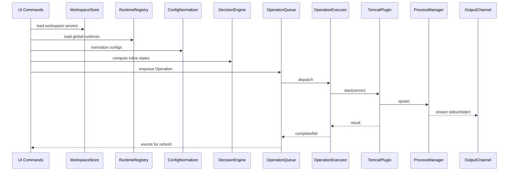

# specs.md — Java Server Manager (JSM) — Frozen Specification v1.0

> **Status:** FROZEN — Implementation-ready  
> **Scope:** v1 Tomcat-only, plugin-ready architecture  
> **Last Updated:** 2025-12-23

---

## Table of Contents

1. [Product Overview](#1-product-overview)
2. [Goals, Non-Goals, Philosophy](#2-goals-non-goals-philosophy)
3. [Terminology](#3-terminology)
4. [User Personas and Workflows](#4-user-personas-and-workflows)
5. [Requirements](#5-requirements)
6. [UX / UI Specification](#6-ux--ui-specification)
7. [Architecture Blueprint](#7-architecture-blueprint)
8. [Data Model](#8-data-model)
9. [Persistence](#9-persistence)
10. [Commands, Contributions, and UI Wiring](#10-commands-contributions-and-ui-wiring)
11. [Wizard / Creation UX](#11-wizard--creation-ux)
12. [Core Services Specification](#12-core-services-specification)
13. [Plugin System](#13-plugin-system)
14. [Tomcat Algorithmic Spec](#14-tomcat-algorithmic-spec)
15. [Deployments and Sync](#15-deployments-and-sync)
16. [Logs](#16-logs)
17. [Error Handling](#17-error-handling)
18. [Security Requirements](#18-security-requirements)
19. [Performance Notes](#19-performance-notes)
20. [Testing Plan](#20-testing-plan)
21. [CI/CD Minimal](#21-cicd-minimal)
22. [Roadmap](#22-roadmap)
23. [Appendices](#23-appendices)

---

## 1. Product Overview

**Java Server Manager (JSM)** is a VSCode extension that manages local Java application servers.

- **v1 scope:** Tomcat only
- **Architecture:** Plugin-ready for Jetty/WildFly/etc.
- **Primary concept:** Servers and Deployments as first-class tree items

---

## 2. Goals, Non-Goals, Philosophy

### 2.1 Goals

- **Minimal UI:** Tree shows only Servers and Deployments (no Logs/Actions/Groups nodes)
- **Complete inline actions:** Run/Debug/Stop/Restart readily available, state-dependent
- **Everything else:** Right-click context menu + Output Channels
- **Single "Sync" action:** System decides incremental vs full automatically
- **Automatic multi-instance Tomcat:**
  - `CATALINA_HOME` = shared runtime (global storage)
  - `CATALINA_BASE` = per-server instance (auto-created in workspace)
- **Professional quality:** SOLID/SRP/DRY, predictable, safe process management

### 2.2 Non-Goals (v1)

- Remote hosts, Docker/K8s orchestration
- Full IDE replacement for Maven/Gradle
- Secrets management beyond basic redaction
- Custom `server.xml` templates *(DECISION: defer to v1.1)*

### 2.3 "No UI Clutter" Principle (Formalized)

- **Tree:** Only Servers and Deployments as nodes (no Logs, Actions, Groups)
- **Logs:** Access via context menu → opens Output Channel or file in editor
- **Actions:** Inline actions (state-dependent) + context menu only
- **No extra nodes:** Zero auxiliary nodes in tree structure

### 2.4 Philosophy

- **Explicit actions, automatic strategy**
- User triggers explicit inline action; no surprise starts/stops
- Core logic independent from VSCode APIs (adapters only)

---

## 3. Terminology

| Term | Definition |
|------|------------|
| **Runtime** | Tomcat installation path (`CATALINA_HOME`), stored globally |
| **Server** | Configured instance referencing a runtime + its own base directory (`CATALINA_BASE`) |
| **Deployment** | Artifact mapped to server's `webapps/` (WAR or exploded folder) |
| **Sync** | User action that updates deployment target; strategy chosen automatically |
| **Inline actions** | Per-item toolbar icons in Tree view |
| **Context menu** | Right-click menu on server/deployment/view background |

---

## 4. User Personas and Workflows

### 4.1 Personas

**Persona A — Local Java Dev**
- 1–2 Tomcat installations, 1–3 servers with different ports
- Wants one-click start + easy sync during coding

**Persona B — Multi-module Dev**
- Many deployments, frequent file changes
- Needs autosync and robust storm handling

### 4.2 Workflows

**Workflow 1 — Setup (first time)**
1. Add Tomcat server → wizard auto-creates `CATALINA_BASE`
2. Add deployment(s)
3. Start (Run / Debug)
4. Sync

**Workflow 2 — Daily loop**
1. Run/Debug
2. Sync deployment occasionally (or autosync)
3. Inspect logs via context menu
4. Stop

---

## 5. Requirements

### 5.1 Functional Requirements

| ID | Requirement |
|----|-------------|
| FR-1 | Tree shows: View root → Servers → Deployments only |
| FR-2 | Inline actions: Run/Debug/Stop/Restart/Cancel/Edit/Output (state-dependent) |
| FR-3 | Multi-instance Tomcat via `CATALINA_HOME` + `CATALINA_BASE` |
| FR-4 | Auto-create base folder at `${workspace}/.jsm/tomcat-bases/<serverId>/` |
| FR-5 | Deployment types: WAR, exploded directory |
| FR-6 | User sees only "Sync"; system chooses incremental vs full |
| FR-7 | Cross-platform process management (macOS/Linux/Windows) |
| FR-8 | Open Logs via context menu → Output Channels |
| FR-9 | Copy Diagnostics to clipboard (deterministic bundle) |
| FR-10 | Schema migration from legacy config |
| FR-11 | Port allocation: auto-suggest next free port if conflict (8080→8081→...) |
| FR-12 | Deploy atomicity: staging in temp → rename/swap; rollback on failure |
| FR-13 | Operation priority: Stop/Cancel > Sync/Refresh (no deadlock) |
| FR-14 | Java auto-detect with fallback to manual selection |

### 5.2 Non-Functional Requirements

| ID | Requirement |
|----|-------------|
| NFR-1 | SOLID, SRP, DRY, modular, testable code |
| NFR-2 | DecisionEngine and normalizers are pure and deterministic |
| NFR-3 | No shell execution; spawn with argv arrays only |
| NFR-4 | Debug binds to `127.0.0.1` only |
| NFR-5 | Async IO; no UI freezes |
| NFR-6 | Debounce watchers; cap ring buffers |

---

## 6. UX / UI Specification

### 6.1 Minimal Tree

```
Java Server Manager
├── Tomcat • <name> • <state>
│   ├── <deploymentName> • <state>
│   └── <deploymentName> • <state>
└── Tomcat • <name> • <state>
    └── ...
```

**Rules:**
- No logs nodes
- No action nodes
- No grouping nodes

### 6.2 Inline Actions

#### Server Inline Actions (state-dependent)

| State | Actions (order) |
|-------|-----------------|
| `stopped` / `error` | Run, Debug, Edit, Output |
| `running` | Stop, Restart, ReDebug, Output |
| `starting` / `stopping` | Cancel, Output |

#### Deployment Inline Actions (always visible)

| Order | Action |
|-------|--------|
| 1 | Sync |
| 2 | Undeploy |
| 3 | Edit |

**Rule:** Inline actions hidden when not meaningful (not just disabled).

### 6.3 Context Menus

#### Server Context Menu

| Group | Commands |
|-------|----------|
| `lifecycle@1` | Run, Debug, Stop, Restart Run, Restart Debug, Cancel, Refresh Status |
| `deploy@2` | Sync All Deployments, Full Redeploy All |
| `manage@3` | Edit, Duplicate, Remove, Open Config, Open Home |
| `troubleshooting@4` | Open Logs, Open Output, Copy Diagnostics |

#### Deployment Context Menu

| Group | Commands |
|-------|----------|
| `actions@1` | Sync, Full Redeploy, Undeploy |
| `autosync@2` | Toggle Autosync, Configure Ignore Globs |
| `manage@3` | Edit, Remove |
| `troubleshooting@4` | Open Logs |

#### View Background Context Menu

- Add Tomcat Server
- Refresh
- Open Docs

### 6.4 Notifications and Microcopy

**Rules:**
- No stack traces in notifications
- Details go to OutputChannel

| Event | Message |
|-------|---------|
| Start | `Starting Tomcat: <name>…` |
| Start success | `Tomcat is running at http://127.0.0.1:<port>` |
| Stop | `Stopping Tomcat: <name>…` |
| Stop escalated | `Stopping Tomcat: <name>… (force)` |
| Sync | `Syncing <deployName>…` |
| Strategy switch | `Large change detected — using Full Redeploy (files=<n>, bytes=<m>)` |

### 6.5 Output Channels

| Channel | Content |
|---------|---------|
| `JSM` | Core decisions, high-level info |
| `JSM: <serverName>` | Server stdout/stderr, plugin logs |

---

## 7. Architecture Blueprint

### 7.1 Layering Rules

```
┌─────────────────────────────────────────────────┐
│                    UI Layer                      │
│  (Tree provider, commands, output adapter)       │
│  → imports `vscode` only                         │
├─────────────────────────────────────────────────┤
│                 Core Layer                       │
│  (config, runtimes, ops, decision, diag, errors) │
│  → NO `vscode` imports                           │
├─────────────────────────────────────────────────┤
│               Platform Layer                     │
│  (ProcessManager, PortsAdapter, FileUtils)       │
│  → NO `vscode` imports                           │
├─────────────────────────────────────────────────┤
│               Plugins Layer                      │
│  (interfaces, registry, TomcatPlugin)            │
│  → NO `vscode` imports                           │
└─────────────────────────────────────────────────┘
```

### 7.2 Modules (To-Be)

```
src/
├── ui/
│   ├── tree/ServerTreeViewProvider.ts
│   ├── commands/index.ts
│   └── adapters/OutputChannelAdapter.ts
├── core/
│   ├── config/
│   │   ├── WorkspaceStore.ts
│   │   ├── ConfigNormalizer.ts
│   │   └── migrations/
│   ├── runtimes/GlobalRuntimeRegistry.ts
│   ├── ops/
│   │   ├── OperationQueue.ts
│   │   └── OperationExecutor.ts
│   ├── decision/DecisionEngine.ts
│   ├── diag/DiagnosticsService.ts
│   └── errors/
├── platform/
│   ├── ProcessManager.ts
│   ├── PortsAdapter.ts
│   └── FileUtils.ts
└── plugins/
    ├── interfaces/IServerPlugin.ts
    ├── registry/PluginRegistry.ts
    └── implementations/TomcatPlugin.ts
```

**As-Is Anchoring:**
- `IServerPlugin` exists: `src/core/server/plugins/interfaces/IServerPlugin.ts`
- `TomcatPlugin` exists: `src/core/server/plugins/implementations/TomcatPlugin.ts` (518 lines)
- `EventBus` exists: `src/core/EventBus.ts`
- `ConfigManager` exists: `src/core/config/ConfigManager.ts`
- ⚠️ `DecisionEngine`, `OperationQueue`, `ProcessManager`, `DiagnosticsService` → TO BE CREATED

### 7.3 Core Data Flow



---

## 8. Data Model

### 8.1 Entities

```typescript
// Types (src/core/types/domain.ts - VERIFIED)
export type ServerId = string;
export type DeploymentId = string;
export type ServerState = 'stopped' | 'starting' | 'running' | 'stopping' | 'error';
export type DeploymentState = 'undeployed' | 'deploying' | 'synced' | 'error';
export type DeploymentType = 'war' | 'exploded';
```

### 8.2 ServerConfig Schema

```typescript
interface ServerConfig {
  id: string;                    // UUID
  name: string;                  // Display name
  runtimeId: string;             // Reference to global runtime
  catalinaBase: string;          // Auto-created instance path
  javaHome: string;              // Explicit JAVA_HOME (DECISION: mandatory)
  host: string;                  // Default: "127.0.0.1"
  httpPort: number;              // Default: 8080
  debugPort: number;             // Default: 5005
  shutdownPort: number;          // Default: 8005
  autoSync: boolean;             // Default: true
  vmArgs?: string;
  envVars?: Record<string, string>;
  startupTimeout?: number;       // ms, default: 60000
  stopTimeout?: number;          // ms, default: 10000
  deployments: DeploymentConfig[];
}

interface DeploymentConfig {
  id: string;                    // UUID
  name: string;                  // Context path name
  sourcePath: string;            // Absolute or workspace-relative
  type: DeploymentType;          // 'war' | 'exploded'
  ignoreGlobs?: string[];        // For autosync
}
```

### 8.3 Runtime State (In-Memory)

```typescript
interface ServerRuntimeState {
  state: ServerState;
  pid?: number;
  lastTransitionAt: number;
  lastError?: JsmError;
  activeOperation?: OperationRef;
  recentFailures: FailureMemory;
}

interface DeploymentRuntimeState {
  state: DeploymentState;
  lastSyncAt?: number;
  lastError?: JsmError;
}

interface FailureMemory {
  count: number;
  lastFailureAt: number;
  cooldownUntil?: number;
}
```

---

## 9. Persistence

### 9.1 Workspace Config

**Path:** `.vscode/jsm.servers.json`

```json
{
  "schemaVersion": 2,
  "servers": [
    {
      "id": "abc123",
      "name": "Dev Tomcat",
      "runtimeId": "runtime-xyz",
      "catalinaBase": "${workspaceFolder}/.jsm/tomcat-bases/abc123",
      "javaHome": "/path/to/jdk",
      "host": "127.0.0.1",
      "httpPort": 8080,
      "debugPort": 5005,
      "shutdownPort": 8005,
      "autoSync": true,
      "deployments": []
    }
  ]
}
```

### 9.2 Global Runtime Registry

**Path:** `${globalStoragePath}/jsm.runtimes.json`

```json
{
  "schemaVersion": 1,
  "runtimes": [
    {
      "id": "runtime-xyz",
      "type": "tomcat",
      "catalinaHome": "/opt/tomcat-10.1",
      "version": "10.1.18",
      "detectedAt": 1703347200000
    }
  ]
}
```

### 9.3 Schema Versioning

| Store | Current Version |
|-------|-----------------|
| Workspace | 2 |
| Global Runtimes | 1 |

### 9.4 Migration Algorithm

**Migration 1 → 2 (Workspace):**

```typescript
function migrateV1ToV2(config: V1Config): V2Config {
  return {
    schemaVersion: 2,
    servers: config.servers.map(server => {
      // Legacy: serverHome was both CATALINA_HOME and CATALINA_BASE
      const runtimeId = stableRuntimeId(server.serverHome);
      
      // Register runtime globally if not exists
      ensureRuntimeExists({
        id: runtimeId,
        catalinaHome: server.serverHome,
        type: 'tomcat'
      });
      
      // Build new config object explicitly (omit serverHome, don't set undefined)
      // NOTE: Simply not copying serverHome produces clean JSON
      return {
        id: server.id,
        name: server.name,
        runtimeId,
        catalinaBase: server.serverHome, // Legacy single-dir mode
        javaHome: server.javaHome,
        host: server.host,
        httpPort: server.port,
        debugPort: server.debug?.port ?? 5005,
        shutdownPort: 8005,
        autoSync: server.autoSync ?? true,
        vmArgs: server.vmArgs,
        envVars: server.envVars,
        deployments: server.deployments ?? []
      };
    })
  };
}

function stableRuntimeId(catalinaHome: string): string {
  // Normalize path and hash
  const normalized = path.normalize(catalinaHome).toLowerCase();
  return crypto.createHash('md5').update(normalized).digest('hex').slice(0, 12);
}

// Atomic config write (prevents corruption on crash)
async function saveWorkspaceConfig(config: V2Config): Promise<void> {
  const configPath = path.join(workspaceFolder, '.vscode', 'jsm.servers.json');
  const tempPath = `${configPath}.tmp.${Date.now()}`;
  
  // Ensure directory exists
  await fs.mkdir(path.dirname(configPath), { recursive: true });
  
  // Write to temp file
  await fs.writeFile(tempPath, JSON.stringify(config, null, 2), 'utf-8');
  
  // Replace atomically (or deterministically on Windows)
  await atomicReplaceFile(tempPath, configPath);
}

/**
 * Atomic file replacement helper.
 * - POSIX: rename() overwrites existing file atomically.
 * - Windows: rename fails if target exists; use rm + rename with retry.
 */
async function atomicReplaceFile(tempPath: string, finalPath: string): Promise<void> {
  if (process.platform !== 'win32') {
    // POSIX: atomic rename over existing
    await fs.rename(tempPath, finalPath);
    return;
  }
  
  // Windows: deterministic replace with retry/backoff
  const MAX_RETRIES = 3;
  const BACKOFF_MS = [100, 500, 1000];
  
  for (let attempt = 0; attempt < MAX_RETRIES; attempt++) {
    try {
      // Remove existing if present
      await fs.rm(finalPath, { force: true });
      // Rename temp to final
      await fs.rename(tempPath, finalPath);
      return;
    } catch (e: any) {
      if ((e.code === 'EBUSY' || e.code === 'EPERM') && attempt < MAX_RETRIES - 1) {
        await sleep(BACKOFF_MS[attempt]);
        continue;
      }
      // Cleanup temp on final failure
      await fs.rm(tempPath, { force: true }).catch(() => {});
      throw e;
    }
  }
}
// NOTE: Atomic on POSIX; deterministic replace on Windows.
```

**Warning:** Log to output channel: `"Legacy single-dir mode detected; consider migrating to multi-instance base."`

---

## 10. Commands, Contributions, and UI Wiring

### 10.1 Command Catalog

#### Server Commands

| Command ID | Title | Icon |
|------------|-------|------|
| `jsm.server.add` | Add Server | `$(add)` |
| `jsm.server.startRun` | Start (Run) | `$(play)` |
| `jsm.server.startDebug` | Start (Debug) | `$(debug-alt)` |
| `jsm.server.stop` | Stop | `$(stop)` |
| `jsm.server.restartRun` | Restart (Run) | `$(refresh)` |
| `jsm.server.restartDebug` | Restart (Debug) | `$(debug-rerun)` |
| `jsm.server.cancelOperation` | Cancel | `$(close)` |
| `jsm.server.refreshStatus` | Refresh Status | `$(sync)` |
| `jsm.server.syncAllDeployments` | Sync All | `$(sync)` |
| `jsm.server.fullRedeployAll` | Full Redeploy All | `$(cloud-upload)` |
| `jsm.server.edit` | Edit Server | `$(edit)` |
| `jsm.server.duplicate` | Duplicate | `$(copy)` |
| `jsm.server.remove` | Remove | `$(trash)` |
| `jsm.server.openHome` | Open Home | `$(folder-opened)` |
| `jsm.server.openConfig` | Open Config | `$(settings-gear)` |
| `jsm.server.openOutput` | Open Output | `$(output)` |
| `jsm.server.openLogs` | Open Logs | `$(file)` |

#### Deployment Commands

| Command ID | Title | Icon |
|------------|-------|------|
| `jsm.deployment.add` | Add Deployment | `$(file-add)` |
| `jsm.deployment.sync` | Sync | `$(sync)` |
| `jsm.deployment.fullRedeploy` | Full Redeploy | `$(cloud-upload)` |
| `jsm.deployment.undeploy` | Undeploy | `$(cloud-download)` |
| `jsm.deployment.toggleAutosync` | Toggle Autosync | `$(sync)` |
| `jsm.deployment.configureIgnoreGlobs` | Configure Ignore | `$(filter)` |
| `jsm.deployment.edit` | Edit | `$(edit)` |
| `jsm.deployment.remove` | Remove | `$(trash)` |
| `jsm.deployment.openLogs` | Open Logs | `$(file)` |

#### Global Commands

| Command ID | Title |
|------------|-------|
| `jsm.diagnostics.copy` | Copy Diagnostics |
| `jsm.view.refresh` | Refresh |
| `jsm.docs.open` | Open Docs |

### 10.2 Context Values

```typescript
// Server states
const SERVER_CONTEXTS = [
  'jsm.server.stopped',
  'jsm.server.starting',
  'jsm.server.running',
  'jsm.server.stopping',
  'jsm.server.error'
] as const;

// Deployment states
const DEPLOYMENT_CONTEXTS = [
  'jsm.deployment.undeployed',
  'jsm.deployment.deploying',
  'jsm.deployment.synced',
  'jsm.deployment.error'
] as const;
```

### 10.3 Inline Mapping

#### Server Inline Actions

```json
{
  "view/item/context": [
    {
      "command": "jsm.server.startRun",
      "when": "viewItem =~ /jsm\\.server\\.(stopped|error)/",
      "group": "inline@1"
    },
    {
      "command": "jsm.server.startDebug",
      "when": "viewItem =~ /jsm\\.server\\.(stopped|error)/",
      "group": "inline@2"
    },
    {
      "command": "jsm.server.edit",
      "when": "viewItem =~ /jsm\\.server\\.(stopped|error)/",
      "group": "inline@3"
    },
    {
      "command": "jsm.server.openOutput",
      "when": "viewItem =~ /jsm\\.server\\.(stopped|error)/",
      "group": "inline@4"
    },
    {
      "command": "jsm.server.stop",
      "when": "viewItem == jsm.server.running",
      "group": "inline@1"
    },
    {
      "command": "jsm.server.restartRun",
      "when": "viewItem == jsm.server.running",
      "group": "inline@2"
    },
    {
      "command": "jsm.server.restartDebug",
      "when": "viewItem == jsm.server.running",
      "group": "inline@3"
    },
    {
      "command": "jsm.server.openOutput",
      "when": "viewItem == jsm.server.running",
      "group": "inline@4"
    },
    {
      "command": "jsm.server.cancelOperation",
      "when": "viewItem =~ /jsm\\.server\\.(starting|stopping)/",
      "group": "inline@1"
    },
    {
      "command": "jsm.server.openOutput",
      "when": "viewItem =~ /jsm\\.server\\.(starting|stopping)/",
      "group": "inline@2"
    }
  ]
}
```

#### Deployment Inline Actions

```json
{
  "view/item/context": [
    {
      "command": "jsm.deployment.sync",
      "when": "viewItem =~ /jsm\\.deployment\\./",
      "group": "inline@1"
    },
    {
      "command": "jsm.deployment.undeploy",
      "when": "viewItem =~ /jsm\\.deployment\\./",
      "group": "inline@2"
    },
    {
      "command": "jsm.deployment.edit",
      "when": "viewItem =~ /jsm\\.deployment\\./",
      "group": "inline@3"
    }
```

### 10.4 Menu Contributions (package.json exact format)

**FINAL: Complete contributions for `package.json`**

**Inline Action Visibility Rule:** Actions are HIDDEN (not disabled) when not applicable.  
This is enforced via `when` clauses; no programmatic enable/disable needed.

```json
{
  "contributes": {
    "views": {
      "javaServerManager": [
        {
          "id": "javaServerManagerView",
          "name": "Java Servers",
          "when": "workspaceFolderCount > 0"
        }
      ]
    },
    "viewsContainers": {
      "activitybar": [
        {
          "id": "javaServerManager",
          "title": "Java Server Manager",
          "icon": "$(server)"
        }
      ]
    },
    "menus": {
      "view/title": [
        {
          "command": "jsm.server.add",
          "when": "view == javaServerManagerView",
          "group": "navigation@1"
        },
        {
          "command": "jsm.view.refresh",
          "when": "view == javaServerManagerView",
          "group": "navigation@2"
        },
        {
          "command": "jsm.docs.open",
          "when": "view == javaServerManagerView",
          "group": "navigation@3"
        }
      ],
      "view/item/context": [
        // ═══════════════════════════════════════════════════════════════
        // SERVER INLINE ACTIONS (state-dependent)
        // ═══════════════════════════════════════════════════════════════
        
        // Stopped/Error state
        { "command": "jsm.server.startRun", "when": "view == javaServerManagerView && viewItem =~ /jsm\\.server\\.(stopped|error)/", "group": "inline@1" },
        { "command": "jsm.server.startDebug", "when": "view == javaServerManagerView && viewItem =~ /jsm\\.server\\.(stopped|error)/", "group": "inline@2" },
        { "command": "jsm.server.edit", "when": "view == javaServerManagerView && viewItem =~ /jsm\\.server\\.(stopped|error)/", "group": "inline@3" },
        { "command": "jsm.server.openOutput", "when": "view == javaServerManagerView && viewItem =~ /jsm\\.server\\.(stopped|error)/", "group": "inline@4" },
        
        // Running state
        { "command": "jsm.server.stop", "when": "view == javaServerManagerView && viewItem == jsm.server.running", "group": "inline@1" },
        { "command": "jsm.server.restartRun", "when": "view == javaServerManagerView && viewItem == jsm.server.running", "group": "inline@2" },
        { "command": "jsm.server.restartDebug", "when": "view == javaServerManagerView && viewItem == jsm.server.running", "group": "inline@3" },
        { "command": "jsm.server.openOutput", "when": "view == javaServerManagerView && viewItem == jsm.server.running", "group": "inline@4" },
        
        // Starting/Stopping state (Cancel + Output only)
        { "command": "jsm.server.cancelOperation", "when": "view == javaServerManagerView && viewItem =~ /jsm\\.server\\.(starting|stopping)/", "group": "inline@1" },
        { "command": "jsm.server.openOutput", "when": "view == javaServerManagerView && viewItem =~ /jsm\\.server\\.(starting|stopping)/", "group": "inline@2" },

        // ═══════════════════════════════════════════════════════════════
        // SERVER CONTEXT MENU
        // ═══════════════════════════════════════════════════════════════
        
        // Lifecycle group
        { "command": "jsm.server.startRun", "when": "view == javaServerManagerView && viewItem =~ /jsm\\.server\\./", "group": "lifecycle@1" },
        { "command": "jsm.server.startDebug", "when": "view == javaServerManagerView && viewItem =~ /jsm\\.server\\./", "group": "lifecycle@2" },
        { "command": "jsm.server.stop", "when": "view == javaServerManagerView && viewItem =~ /jsm\\.server\\./", "group": "lifecycle@3" },
        { "command": "jsm.server.restartRun", "when": "view == javaServerManagerView && viewItem =~ /jsm\\.server\\./", "group": "lifecycle@4" },
        { "command": "jsm.server.restartDebug", "when": "view == javaServerManagerView && viewItem =~ /jsm\\.server\\./", "group": "lifecycle@5" },
        { "command": "jsm.server.cancelOperation", "when": "view == javaServerManagerView && viewItem =~ /jsm\\.server\\./", "group": "lifecycle@6" },
        { "command": "jsm.server.refreshStatus", "when": "view == javaServerManagerView && viewItem =~ /jsm\\.server\\./", "group": "lifecycle@7" },
        
        // Deploy group
        { "command": "jsm.server.syncAllDeployments", "when": "view == javaServerManagerView && viewItem =~ /jsm\\.server\\./", "group": "deploy@1" },
        { "command": "jsm.server.fullRedeployAll", "when": "view == javaServerManagerView && viewItem =~ /jsm\\.server\\./", "group": "deploy@2" },
        
        // Manage group
        { "command": "jsm.server.edit", "when": "view == javaServerManagerView && viewItem =~ /jsm\\.server\\./", "group": "manage@1" },
        { "command": "jsm.server.duplicate", "when": "view == javaServerManagerView && viewItem =~ /jsm\\.server\\./", "group": "manage@2" },
        { "command": "jsm.server.remove", "when": "view == javaServerManagerView && viewItem =~ /jsm\\.server\\./", "group": "manage@3" },
        { "command": "jsm.server.openConfig", "when": "view == javaServerManagerView && viewItem =~ /jsm\\.server\\./", "group": "manage@4" },
        { "command": "jsm.server.openHome", "when": "view == javaServerManagerView && viewItem =~ /jsm\\.server\\./", "group": "manage@5" },
        
        // Troubleshooting group
        { "command": "jsm.server.openLogs", "when": "view == javaServerManagerView && viewItem =~ /jsm\\.server\\./", "group": "troubleshooting@1" },
        { "command": "jsm.server.openOutput", "when": "view == javaServerManagerView && viewItem =~ /jsm\\.server\\./", "group": "troubleshooting@2" },
        { "command": "jsm.diagnostics.copy", "when": "view == javaServerManagerView && viewItem =~ /jsm\\.server\\./", "group": "troubleshooting@3" },

        // ═══════════════════════════════════════════════════════════════
        // DEPLOYMENT INLINE ACTIONS (always visible)
        // ═══════════════════════════════════════════════════════════════
        { "command": "jsm.deployment.sync", "when": "view == javaServerManagerView && viewItem =~ /jsm\\.deployment\\./", "group": "inline@1" },
        { "command": "jsm.deployment.undeploy", "when": "view == javaServerManagerView && viewItem =~ /jsm\\.deployment\\./", "group": "inline@2" },
        { "command": "jsm.deployment.edit", "when": "view == javaServerManagerView && viewItem =~ /jsm\\.deployment\\./", "group": "inline@3" },

        // ═══════════════════════════════════════════════════════════════
        // DEPLOYMENT CONTEXT MENU
        // ═══════════════════════════════════════════════════════════════
        
        // Actions group
        { "command": "jsm.deployment.sync", "when": "view == javaServerManagerView && viewItem =~ /jsm\\.deployment\\./", "group": "actions@1" },
        { "command": "jsm.deployment.fullRedeploy", "when": "view == javaServerManagerView && viewItem =~ /jsm\\.deployment\\./", "group": "actions@2" },
        { "command": "jsm.deployment.undeploy", "when": "view == javaServerManagerView && viewItem =~ /jsm\\.deployment\\./", "group": "actions@3" },
        
        // Autosync group
        { "command": "jsm.deployment.toggleAutosync", "when": "view == javaServerManagerView && viewItem =~ /jsm\\.deployment\\./", "group": "autosync@1" },
        { "command": "jsm.deployment.configureIgnoreGlobs", "when": "view == javaServerManagerView && viewItem =~ /jsm\\.deployment\\./", "group": "autosync@2" },
        
        // Manage group
        { "command": "jsm.deployment.edit", "when": "view == javaServerManagerView && viewItem =~ /jsm\\.deployment\\./", "group": "manage@1" },
        { "command": "jsm.deployment.remove", "when": "view == javaServerManagerView && viewItem =~ /jsm\\.deployment\\./", "group": "manage@2" },
        
        // Troubleshooting group
        { "command": "jsm.deployment.openLogs", "when": "view == javaServerManagerView && viewItem =~ /jsm\\.deployment\\./", "group": "troubleshooting@1" }
      ]
    }
  }
}
```

### 10.5 Ignore Globs Configuration UI

**DECISION (Q6): Webview form inside Edit Deployment panel**

```
┌─────────────────────────────────────────────────────────────┐
│  Edit Deployment: myapp                                     │
├─────────────────────────────────────────────────────────────┤
│  Source Path: [./target/myapp] [Browse...]                  │
│  Deploy Name: [myapp                  ]                     │
│  Type:        (•) Exploded  ( ) WAR                         │
│                                                             │
│  ─── Autosync Settings ───────────────────────────────      │
│  [✓] Enable Autosync                                        │
│                                                             │
│  Ignore Patterns:                                           │
│  ┌─────────────────────────────────┬───────┐                │
│  │ *.tmp                           │ [×]   │                │
│  │ *.log                           │ [×]   │                │
│  │ .git/**                         │ [×]   │                │
│  │ node_modules/**                 │ [×]   │                │
│  └─────────────────────────────────┴───────┘                │
│  [+ Add Pattern]  [Reset Defaults]                          │
│                                                             │
│  [Cancel]                              [Save]               │
└─────────────────────────────────────────────────────────────┘
```

**Default ignore patterns:**
```typescript
const DEFAULT_IGNORE_GLOBS = [
  '*.tmp',
  '*.log',
  '*.swp',
  '.git/**',
  '.svn/**',
  '.idea/**',
  '.vscode/**',
  'node_modules/**',
  '__pycache__/**',
  '*.pyc'
];
```

---

## 11. Wizard / Creation UX

### 11.1 Add Tomcat Server Flow

**UI:** Webview-based form (DECISION: use existing `ServerFormPanel.ts`)

#### Step 1: Select Tomcat Runtime

```
┌─────────────────────────────────────────┐
│  Select Tomcat Installation             │
├─────────────────────────────────────────┤
│  [Browse...] /opt/apache-tomcat-10.1    │
│                                         │
│  ✓ Valid Tomcat 10.1.18 detected        │
└─────────────────────────────────────────┘
```

- Directory picker
- Validate: `bin/catalina.sh` or `bin/catalina.bat` exists
- Detect version via `bin/version.sh` or parse `RELEASE-NOTES`
- Reuse existing runtime if same normalized path

#### Step 2: Server Name & Ports

```
┌─────────────────────────────────────────┐
│  Server Configuration                   │
├─────────────────────────────────────────┤
│  Name:      [Dev Tomcat           ]     │
│  HTTP Port: [8080] ✓ Available          │
│  Debug Port:[5005] ✓ Available          │
│  Shutdown:  [8005] ✓ Available          │
│                                         │
│  Instance Path (auto):                  │
│  .jsm/tomcat-bases/abc123/              │
└─────────────────────────────────────────┘
```

- Auto-suggest free ports if conflicts
- Instance path is read-only (auto-created)

#### Step 3: Select JAVA_HOME (Auto-Detect with Fallback)

```
┌─────────────────────────────────────────┐
│  Java Runtime                           │
├─────────────────────────────────────────┤
│  ● Auto-detected: /opt/jdk-17           │
│    Java 17.0.9 (OpenJDK)                │
│                                         │
│  ○ Manual: [Browse...]                  │
└─────────────────────────────────────────┘
```

**DECISION (Q4): Java auto-detect with strict fallback:**

```typescript
async function detectJavaHome(): Promise<Result<string, JsmError>> {
  // 1. Try JAVA_HOME env var
  if (process.env.JAVA_HOME) {
    const valid = await validateJavaHome(process.env.JAVA_HOME);
    if (valid.ok) return ok(process.env.JAVA_HOME);
  }
  
  // 2. Try common paths
  const candidates = [
    '/usr/lib/jvm/default-java',
    '/usr/lib/jvm/java-17-openjdk',
    '/Library/Java/JavaVirtualMachines/*/Contents/Home',
    'C:\\Program Files\\Java\\jdk-*'
  ];
  
  for (const pattern of candidates) {
    const matches = await glob(pattern);
    for (const match of matches) {
      const valid = await validateJavaHome(match);
      if (valid.ok) return ok(match);
    }
  }
  
  // 3. Fallback: require manual selection (no silent fail)
  return err(new JsmError('JavaNotFound', 
    'No Java installation detected. Please select JAVA_HOME manually.'));
}

async function validateJavaHome(javaHome: string): Promise<Result<void, JsmError>> {
  const javaExe = path.join(javaHome, 'bin', 
    process.platform === 'win32' ? 'java.exe' : 'java');
  
  // Must exist
  if (!await fileExists(javaExe)) {
    return err(new JsmError('JavaNotFound', `java executable not found: ${javaExe}`));
  }
  
  // Must execute successfully
  try {
    await execFile(javaExe, ['-version']);
    return ok(undefined);
  } catch (e) {
    return err(new JsmError('JavaNotFound', `java -version failed: ${e}`));
  }
}
```

**UI Behavior:**
- Wizard pre-selects auto-detected Java if valid
- If auto-detect fails → show warning, require manual selection
- No silent failures

#### Step 4: Deployments (Optional)

```
┌─────────────────────────────────────────┐
│  Deployments (optional)                 │
├─────────────────────────────────────────┤
│  [+ Add Deployment]                     │
│                                         │
│  No deployments added                   │
└─────────────────────────────────────────┘
```

#### Step 5: Confirm

Show summary, then create.

### 11.2 Automatic Multi-Instance Model

**Algorithm:**

```typescript
async function createServer(input: WizardInput): Promise<Result<ServerConfig, JsmError>> {
  // 1. Ensure runtime is registered globally
  const runtimeId = await ensureRuntimeRegistered(input.catalinaHome);
  
  // 2. Generate server ID
  const serverId = uuidv4();
  
  // 3. Create CATALINA_BASE path
  const catalinaBase = path.join(
    workspaceFolder,
    '.jsm',
    'tomcat-bases',
    serverId
  );
  
  // 4. Seed base directory
  await seedCatalinaBase(input.catalinaHome, catalinaBase);
  
  // 5. Patch server.xml with ports
  await patchServerXml(catalinaBase, {
    httpPort: input.httpPort,
    shutdownPort: input.shutdownPort,
    disableAjp: true
  });
  
  // 6. Return config
  return ok({
    id: serverId,
    name: input.name,
    runtimeId,
    catalinaBase,
    javaHome: input.javaHome,
    host: '127.0.0.1',
    httpPort: input.httpPort,
    debugPort: input.debugPort,
    shutdownPort: input.shutdownPort,
    autoSync: true,
    deployments: input.deployments ?? []
  });
}
```

### 11.3 Seeding and Patching server.xml

**Seed Algorithm:**

```typescript
async function seedCatalinaBase(catalinaHome: string, catalinaBase: string): Promise<void> {
  // Create directories
  const dirs = ['conf', 'logs', 'webapps', 'temp', 'work'];
  for (const dir of dirs) {
    await fs.mkdir(path.join(catalinaBase, dir), { recursive: true });
  }
  
  // Copy conf files from CATALINA_HOME
  const confSrc = path.join(catalinaHome, 'conf');
  const confDst = path.join(catalinaBase, 'conf');
  await copyDirectory(confSrc, confDst);
}
```

**Patch Algorithm (MUST use XML parser, NOT regex):**

```typescript
import { XMLParser, XMLBuilder } from 'fast-xml-parser';

async function patchServerXml(catalinaBase: string, ports: PortConfig): Promise<void> {
  const xmlPath = path.join(catalinaBase, 'conf', 'server.xml');
  const content = await fs.readFile(xmlPath, 'utf-8');
  
  const parser = new XMLParser({
    ignoreAttributes: false,
    attributeNamePrefix: '@_'
  });
  const builder = new XMLBuilder({
    ignoreAttributes: false,
    attributeNamePrefix: '@_',
    format: true
  });
  
  const xml = parser.parse(content);
  
  // Patch shutdown port
  xml.Server['@_port'] = String(ports.shutdownPort);
  
  // Find and patch HTTP connector
  const connectors = ensureArray(xml.Server.Service.Connector);
  const patchedConnectors: any[] = [];
  
  for (const conn of connectors) {
    // Patch HTTP connector port
    if (conn['@_protocol']?.includes('HTTP') || !conn['@_protocol']) {
      conn['@_port'] = String(ports.httpPort);
      patchedConnectors.push(conn);
    }
    // DECISION: Remove AJP connectors entirely (port=-1 is not valid Tomcat config)
    else if (conn['@_protocol']?.includes('AJP')) {
      // Skip - do not add to patchedConnectors (removes from DOM)
      continue;
    }
    else {
      // Keep other connectors unchanged
      patchedConnectors.push(conn);
    }
  }
  
  // Update connectors in XML (handle single vs array)
  xml.Server.Service.Connector = patchedConnectors.length === 1 
    ? patchedConnectors[0] 
    : patchedConnectors;
  
  const output = builder.build(xml);
  await fs.writeFile(xmlPath, output, 'utf-8');
}
```

---

## 12. Core Services Specification

### 12.1 ConfigNormalizer

**Pure function, no side effects.**

```typescript
interface ConfigNormalizer {
  normalize(raw: RawServerConfig): Result<ServerConfig, JsmError>;
}

function normalize(raw: RawServerConfig): Result<ServerConfig, JsmError> {
  // 1. Resolve paths
  const catalinaBase = resolvePath(raw.catalinaBase, workspaceFolder);
  const javaHome = resolvePath(raw.javaHome, workspaceFolder);
  
  // 2. Normalize separators (cross-platform)
  const normalizedBase = path.normalize(catalinaBase);
  const normalizedJava = path.normalize(javaHome);
  
  // 3. Ensure arrays
  const vmArgs = raw.vmArgs ?? '';
  const deployments = raw.deployments ?? [];
  
  // 4. Apply defaults
  const config: ServerConfig = {
    id: raw.id,
    name: raw.name,
    runtimeId: raw.runtimeId,
    catalinaBase: normalizedBase,
    javaHome: normalizedJava,
    host: raw.host ?? '127.0.0.1',
    httpPort: raw.httpPort ?? 8080,
    debugPort: raw.debugPort ?? 5005,
    shutdownPort: raw.shutdownPort ?? 8005,
    autoSync: raw.autoSync ?? true,
    vmArgs,
    envVars: raw.envVars ?? {},
    startupTimeout: raw.startupTimeout ?? 60000,
    stopTimeout: raw.stopTimeout ?? 10000,
    deployments: deployments.map(normalizeDeployment)
  };
  
  // 5. Validate
  const validation = validate(config);
  if (!validation.ok) return validation;
  
  return ok(config);
}

function normalizeDeployment(raw: RawDeploymentConfig): DeploymentConfig {
  const sourcePath = resolvePath(raw.sourcePath, workspaceFolder);
  const name = raw.name ?? path.basename(sourcePath, '.war');
  const type = raw.type ?? inferType(sourcePath);
  
  // Validate name: no slashes, no ".."
  if (name.includes('/') || name.includes('\\') || name.includes('..')) {
    throw new JsmError('InvalidConfig', `Invalid deployment name: ${name}`);
  }
  
  return { id: raw.id ?? uuidv4(), name, sourcePath, type, ignoreGlobs: raw.ignoreGlobs ?? [] };
}
```

### 12.2 PortsAdapter

```typescript
interface PortsAdapter {
  isPortFree(host: string, port: number): Promise<boolean>;
  isPortResponding(host: string, port: number, timeoutMs?: number): Promise<boolean>;
  suggestFreePort(host: string, preferred: number): Promise<number>;
  waitForReadiness(host: string, port: number, opts: ReadinessOptions): Promise<Result<void, JsmError>>;
}

interface ReadinessOptions {
  timeoutMs: number;        // Total timeout, default: 60000
  pollIntervalMs: number;   // Poll interval, default: 250
  cancellation?: CancellationToken;
}

async function isPortFree(host: string, port: number): Promise<boolean> {
  return new Promise((resolve) => {
    const server = net.createServer();
    server.once('error', () => resolve(false));
    server.once('listening', () => {
      server.close();
      resolve(true);
    });
    server.listen(port, host);
  });
}

// Check if a port is responding (server is listening)
async function isPortResponding(host: string, port: number, timeoutMs = 1000): Promise<boolean> {
  return new Promise((resolve) => {
    const socket = new net.Socket();
    const timer = setTimeout(() => {
      socket.destroy();
      resolve(false);
    }, timeoutMs);
    
    socket.once('connect', () => {
      clearTimeout(timer);
      socket.destroy();
      resolve(true);
    });
    socket.once('error', () => {
      clearTimeout(timer);
      resolve(false);
    });
    socket.connect(port, host);
  });
}

// Wait for server readiness with polling
async function waitForReadiness(
  host: string, 
  port: number, 
  opts: ReadinessOptions
): Promise<Result<void, JsmError>> {
  const deadline = Date.now() + opts.timeoutMs;
  
  while (Date.now() < deadline) {
    // Check cancellation
    if (opts.cancellation?.isCancellationRequested) {
      return err(new JsmError('Cancelled', 'Readiness check cancelled'));
    }
    
    // Check if port is responding
    if (await isPortResponding(host, port)) {
      return ok(undefined);
    }
    
    // Wait before next poll
    await sleep(opts.pollIntervalMs);
  }
  
  return err(new JsmError('TIMEOUT_ERROR', 
    `Server not ready after ${opts.timeoutMs}ms on ${host}:${port}`));
}

async function suggestFreePort(host: string, preferred: number): Promise<number> {
  for (let offset = 0; offset < 100; offset++) {
    const port = preferred + offset;
    if (await isPortFree(host, port)) {
      return port;
    }
  }
  throw new JsmError('PortInUse', `No free port found near ${preferred}`);
}
```

**Port Allocation Policy (FR-11):**

```typescript
// Deterministic port suggestion algorithm
async function allocatePorts(preferred: PortConfig): Promise<PortConfig> {
  const allocated: PortConfig = {};
  
  // HTTP port: 8080 → 8081 → 8082 → ...
  allocated.httpPort = await suggestFreePort('127.0.0.1', preferred.httpPort ?? 8080);
  
  // Debug port: 5005 → 5006 → 5007 → ...
  allocated.debugPort = await suggestFreePort('127.0.0.1', preferred.debugPort ?? 5005);
  
  // Shutdown port: 8005 → 8006 → 8007 → ...
  allocated.shutdownPort = await suggestFreePort('127.0.0.1', preferred.shutdownPort ?? 8005);
  
  return allocated;
}

// Ports MUST be patched in server.xml via XML parser (not regex)
// See §11.3 for patchServerXml algorithm
```

### 12.3 DecisionEngine

**Pure, deterministic function.**

```typescript
interface DecisionEngine {
  decideSyncStrategy(input: SyncDecisionInput): SyncStrategy;
  decideStopStrategy(input: StopDecisionInput): StopStrategy;
  decideReadinessPolicy(input: ReadinessInput): ReadinessPolicy;
}

interface SyncDecisionInput {
  deploymentType: DeploymentType;
  changedFiles: FileChange[];
  totalBytes: number;
  recentFailures: FailureMemory;
}

type SyncStrategy = 'incremental' | 'full';

// DECISION: Thresholds
const THRESHOLDS = {
  maxFilesForIncremental: 200,
  maxBytesForIncremental: 20 * 1024 * 1024, // 20MB
  failureCooldownMs: 30000,
  maxConsecutiveFailures: 3
};

function decideSyncStrategy(input: SyncDecisionInput): SyncStrategy {
  // WAR always full
  if (input.deploymentType === 'war') {
    return 'full';
  }
  
  // In cooldown after failures → full
  if (input.recentFailures.cooldownUntil && Date.now() < input.recentFailures.cooldownUntil) {
    return 'full';
  }
  
  // Too many files → full
  if (input.changedFiles.length > THRESHOLDS.maxFilesForIncremental) {
    return 'full';
  }
  
  // Too many bytes → full
  if (input.totalBytes > THRESHOLDS.maxBytesForIncremental) {
    return 'full';
  }
  
  return 'incremental';
}
```

### 12.4 OperationQueue

```typescript
interface OperationQueue {
  enqueue(serverId: string, op: Operation): void;
  cancel(serverId: string): void;
  getActive(serverId: string): Operation | undefined;
}

// Rules:
// 1. One active operation per server
// 2. Queue per server
// 3. Coalescing rules (see matrix below)

// Coalescing Matrix (COMPLETE):
// ┌──────────────────┬──────────────────┬────────────────────────────────────┐
// │ Pending/Active   │ New Operation    │ Result                             │
// ├──────────────────┼──────────────────┼────────────────────────────────────┤
// │ refresh          │ refresh          │ keep last only                     │
// │ sync(dep1)       │ sync(dep1)       │ keep last (same deployment)        │
// │ sync(dep1)       │ sync(dep2)       │ queue both (different deployments) │
// │ syncAll          │ sync(any)        │ drop sync (syncAll covers it)      │
// │ sync(any)        │ syncAll          │ replace with syncAll               │
// │ start(run)       │ start(run)       │ ignore new (already starting)      │
// │ start(run)       │ start(debug)     │ replace with debug                 │
// │ start(debug)     │ start(run)       │ replace with run                   │
// │ start(any)       │ stop             │ queue stop (wait for start done)   │
// │ stop             │ start(any)       │ queue start (wait for stop done)   │
// │ starting         │ restart(any)     │ queue restart (after start done)   │
// │ stopping         │ restart(any)     │ queue restart (after stop done)    │
// │ running          │ restart(any)     │ execute restart immediately        │
// │ any              │ cancel           │ IMMEDIATE: abort + clear queue     │
// └──────────────────┴──────────────────┴────────────────────────────────────┘
```

**Cancel Semantics:**
```typescript
// Cancel is NOT queued; it preempts immediately
function cancel(serverId: string): void {
  const active = this.active.get(serverId);
  if (active) {
    // 1. Signal cancellation token
    active.cancellation.cancel();
    // 2. Do NOT wait - let operation handle its own cleanup
  }
  // 3. Clear pending queue for this server
  this.queue.delete(serverId);
  // 4. Emit event
  this.eventBus.emit('OperationCancelled', { serverId });
}
```

**Operation Priority (FR-13):**

| Priority | Operations | Behavior |
|----------|------------|----------|
| 1 (highest) | `stop`, `cancel` | Preempts lower-priority ops; executes immediately |
| 2 | `start`, `restart` | Queued; respects coalescing |
| 3 | `sync`, `refresh` | Queued; can be cancelled mid-execution |

**Cancel Checkpoints:**
```typescript
// Long operations MUST check cancellation token at checkpoints
async function syncDeployment(ctx: OpContext): Promise<Result<void, JsmError>> {
  for (const file of files) {
    // Checkpoint: check cancellation before each file
    if (ctx.cancellation.isCancellationRequested) {
      return err(new JsmError('Cancelled', 'Sync cancelled by user'));
    }
    await copyFile(file);
  }
}
```

**Deadlock Prevention:**
- Stop/Cancel never waits for Sync/Refresh
- Sync checks cancellation before each file operation
- Refresh is lightweight and non-blocking

### 12.5 OperationExecutor

```typescript
interface OperationExecutor {
  execute(op: Operation): Promise<Result<void, JsmError>>;
}

// Events emitted (via EventBus):
type ExecutorEvent =
  | { type: 'OperationStarted'; serverId: string; operation: OperationType }
  | { type: 'OperationCompleted'; serverId: string; operation: OperationType }
  | { type: 'OperationFailed'; serverId: string; operation: OperationType; error: JsmError }
  | { type: 'ServerStateChanged'; serverId: string; state: ServerState }
  | { type: 'DeploymentStateChanged'; serverId: string; deploymentId: string; state: DeploymentState };
```

### 12.6 ProcessManager

**Cross-platform process spawning. DECISION: No shell string concatenation.**

```typescript
interface ProcessManager {
  spawn(command: string, args: string[], options: SpawnOptions): Promise<ManagedProcess>;
  kill(process: ManagedProcess): Promise<void>;
}

interface ManagedProcess {
  pid: number;
  stdout: Readable;
  stderr: Readable;
  onExit: Promise<number>;
}

// ═══════════════════════════════════════════════════════════════
// POSIX Implementation (macOS, Linux)
// ═══════════════════════════════════════════════════════════════

async function spawnUnix(cmd: string, args: string[], opts: SpawnOptions): Promise<ManagedProcess> {
  const child = spawn(cmd, args, {
    ...opts,
    detached: true, // New process group for kill -PGID
    shell: false    // NO SHELL - direct exec
  });
  return wrapProcess(child);
}

async function killUnix(proc: ManagedProcess): Promise<void> {
  // 1. SIGTERM to process group
  process.kill(-proc.pid, 'SIGTERM');
  
  // 2. Wait for graceful exit (5s)
  const exited = await Promise.race([
    proc.onExit.then(() => true),
    sleep(5000).then(() => false)
  ]);
  
  if (!exited) {
    // 3. SIGKILL to process group
    process.kill(-proc.pid, 'SIGKILL');
  }
}

// ═══════════════════════════════════════════════════════════════
// Windows Implementation
// DECISION (P0-1): No raw string concat. Use deterministic quoting.
// ═══════════════════════════════════════════════════════════════

/**
 * Quote a single argument for cmd.exe /c command line.
 * Rules: wrap in double quotes, escape internal quotes with backslash.
 */
function quoteCmdArg(arg: string): string {
  if (!/[\s"&|<>^]/.test(arg)) {
    return arg; // No special chars, no quoting needed
  }
  // Escape internal double quotes and wrap
  return `"${arg.replace(/"/g, '\\"')}"`;
}

/**
 * Build a safe command line for cmd.exe /c.
 * Output: cmd.exe /d /s /c ""<batPath>" <args...>"
 * The outer double quotes + /s allow the inner quoted path to work.
 */
function buildCmdCommandLine(batPath: string, args: string[]): string[] {
  const quotedBat = quoteCmdArg(batPath);
  const quotedArgs = args.map(quoteCmdArg).join(' ');
  // /d = no AutoRun, /s = strip outer quotes, /c = execute
  // The double-quote wrapping: cmd.exe /d /s /c ""path" args"
  const cmdLine = quotedArgs ? `"${quotedBat} ${quotedArgs}"` : `"${quotedBat}"`;
  return ['/d', '/s', '/c', cmdLine];
}

async function spawnWindows(batPath: string, args: string[], opts: SpawnOptions): Promise<ManagedProcess> {
  const comSpec = process.env.ComSpec ?? 'cmd.exe';
  const cmdArgs = buildCmdCommandLine(batPath, args);
  
  const child = spawn(comSpec, cmdArgs, {
    ...opts,
    shell: false,      // NO additional shell wrapping
    windowsHide: true  // Hide console window
  });
  return wrapProcess(child);
}

async function killWindows(proc: ManagedProcess): Promise<void> {
  // taskkill /T = kill tree, /F = force
  await execFile('taskkill', ['/T', '/F', '/PID', String(proc.pid)]);
}
```

**NOTE:** Platform dispatcher (`spawnTomcat`, `killTomcat`) belongs in **TomcatPlugin** or a dedicated `TomcatProcessAdapter`, NOT in generic `ProcessManager`. ProcessManager provides only `spawnUnix`, `spawnWindows`, `killUnix`, `killWindows`.

### 12.7 DiagnosticsService

```typescript
interface DiagnosticsService {
  generateBundle(serverId?: string): DiagnosticsBundle;
  copyToClipboard(bundle: DiagnosticsBundle): Promise<void>;
}

interface DiagnosticsBundle {
  timestamp: string;
  extension: { name: string; version: string };
  vscode: { version: string };
  os: { platform: string; release: string };
  workspace: { schemaVersion: number };
  runtimes: RuntimeSummary[];
  servers: ServerSummary[];
  recentLogs: string[];      // Last 100 lines from ring buffer
  lastError?: RedactedError;
}

// Redaction rules:
function redact(obj: unknown): unknown {
  // Redact keys matching: password, secret, token, key, auth
  // Replace values with "[REDACTED]"
}
```

---

## 13. Plugin System

### 13.1 IServerPlugin Interface

**As-Is:** `src/core/server/plugins/interfaces/IServerPlugin.ts` (verified)

```typescript
export interface IServerPlugin {
  readonly type: string;   // e.g., 'tomcat'
  readonly name: string;   // e.g., 'Apache Tomcat'

  capabilities(): PluginCapabilities;

  // Runtime detection
  detectRuntime(catalinaHome: string): Promise<Result<DetectedRuntime, JsmError>>;
  validateServerConfig(server: ServerConfig): Promise<Result<void, JsmError>>;

  // Lifecycle
  start(server: ServerConfig, mode: 'run'|'debug', ctx: OpContext): Promise<Result<StartResult, JsmError>>;
  stop(server: ServerConfig, ctx: OpContext): Promise<Result<void, JsmError>>;
  status(server: ServerConfig, ctx: OpContext): Promise<Result<StatusResult, JsmError>>;

  // Deploy
  syncDeployment(server: ServerConfig, dep: DeploymentConfig, plan: DeployPlan, ctx: OpContext): Promise<Result<void, JsmError>>;
  undeploy(server: ServerConfig, dep: DeploymentConfig, ctx: OpContext): Promise<Result<void, JsmError>>;
  discoverLogs(server: ServerConfig, dep?: DeploymentConfig): Promise<Result<LogSource[], JsmError>>;
}

interface OpContext {
  cancellation: CancellationToken;
  progress: (message: string) => void;
  output: OutputSink;
}
```

### 13.2 Capabilities Model

```typescript
interface PluginCapabilities {
  supportsDebug: boolean;
  supportsIncrementalExploded: boolean;
  supportsWarDeploy: boolean;
  supportsAutosync: boolean;
  supportsMultipleInstances: boolean;
}
```

### 13.3 TomcatPlugin v1 Capabilities

```typescript
const TOMCAT_CAPABILITIES: PluginCapabilities = {
  supportsDebug: true,
  supportsIncrementalExploded: true,
  supportsWarDeploy: true,
  supportsAutosync: true,
  supportsMultipleInstances: true  // via CATALINA_BASE
};
```

---

## 14. Tomcat Algorithmic Spec

### 14.1 Detect Runtime

```typescript
async function detectRuntime(catalinaHome: string): Promise<Result<DetectedRuntime, JsmError>> {
  // 1. Validate structure
  const required = [
    'bin/catalina.sh',  // or .bat on Windows
    'conf/server.xml',
    'lib/catalina.jar'
  ];
  
  for (const file of required) {
    const filePath = path.join(catalinaHome, file);
    const exists = await fileExists(filePath);
    if (!exists) {
      return err(new JsmError('INSTALLATION_VALIDATION_ERROR', 
        `Missing required file: ${file}`));
    }
  }
  
  // 2. Detect version
  let version = 'unknown';
  try {
    // Try version script
    const versionScript = path.join(catalinaHome, 'bin', 
      process.platform === 'win32' ? 'version.bat' : 'version.sh');
    const output = await execFile(versionScript);
    const match = output.match(/Apache Tomcat\/(\d+\.\d+\.\d+)/);
    if (match) version = match[1];
  } catch {
    // Fallback: parse RELEASE-NOTES
    try {
      const notes = await fs.readFile(path.join(catalinaHome, 'RELEASE-NOTES'), 'utf-8');
      const match = notes.match(/Apache Tomcat Version (\d+\.\d+\.\d+)/);
      if (match) version = match[1];
    } catch {
      // Allow unknown version with warning
    }
  }
  
  return ok({ catalinaHome, version, type: 'tomcat' });
}
```

### 14.2 Validate Configuration

```typescript
async function validateServerConfig(server: ServerConfig): Promise<Result<void, JsmError>> {
  const errors: string[] = [];
  
  // 1. JAVA_HOME exists with java executable
  const javaExe = path.join(server.javaHome, 'bin', 
    process.platform === 'win32' ? 'java.exe' : 'java');
  if (!await fileExists(javaExe)) {
    errors.push(`Java executable not found: ${javaExe}`);
  }
  
  // 2. HTTP port free
  if (!await portsAdapter.isPortFree(server.host, server.httpPort)) {
    errors.push(`HTTP port ${server.httpPort} is in use`);
  }
  
  // 3. Debug port free (if debug enabled)
  if (!await portsAdapter.isPortFree(server.host, server.debugPort)) {
    errors.push(`Debug port ${server.debugPort} is in use`);
  }
  
  // 4. CATALINA_BASE exists and writable
  if (!await isWritable(server.catalinaBase)) {
    errors.push(`CATALINA_BASE not writable: ${server.catalinaBase}`);
  }
  
  // 5. server.xml exists
  const serverXml = path.join(server.catalinaBase, 'conf', 'server.xml');
  if (!await fileExists(serverXml)) {
    errors.push(`server.xml not found: ${serverXml}`);
  }
  
  if (errors.length > 0) {
    return err(new JsmError('SERVER_VALIDATION_ERROR', errors.join('; ')));
  }
  
  return ok(undefined);
}
```

### 14.3 Start (Run / Debug)

```typescript
async function start(
  server: ServerConfig, 
  mode: 'run' | 'debug', 
  ctx: OpContext
): Promise<Result<StartResult, JsmError>> {
  // 1. Build environment
  const env = buildEnvironment(server, mode);
  
  // 2. Get script path
  const script = getStartupScript(server);
  const args = mode === 'debug' ? ['jpda', 'run'] : ['run'];
  
  // 3. Spawn process (NO SHELL)
  const proc = await processManager.spawn(script, args, {
    cwd: server.catalinaBase,
    env
  });
  
  // 4. Stream output to channel
  proc.stdout.pipe(ctx.output);
  proc.stderr.pipe(ctx.output);
  
  // 5. Wait for readiness
  const ready = await waitForReadiness(server, ctx.cancellation);
  if (!ready.ok) {
    await processManager.kill(proc);
    return ready;
  }
  
  // 6. Auto-attach debugger if debug mode
  if (mode === 'debug') {
    await attachDebugger(server);
  }
  
  return ok({ pid: proc.pid });
}

function buildEnvironment(server: ServerConfig, mode: 'run' | 'debug'): NodeJS.ProcessEnv {
  const env = { ...process.env, ...server.envVars };
  
  env.CATALINA_HOME = getRuntimePath(server.runtimeId);
  env.CATALINA_BASE = server.catalinaBase;
  env.JAVA_HOME = server.javaHome;
  
  if (server.vmArgs) {
    env.CATALINA_OPTS = server.vmArgs;
  }
  
  if (mode === 'debug') {
    // SECURITY: bind to localhost only
    env.JPDA_ADDRESS = `127.0.0.1:${server.debugPort}`;
    env.JPDA_TRANSPORT = 'dt_socket';
    env.JPDA_SUSPEND = 'n';
  }
  
  return env;
}
```

### 14.4 Stop

```typescript
async function stop(server: ServerConfig, ctx: OpContext): Promise<Result<void, JsmError>> {
  const proc = getActiveProcess(server.id);
  if (!proc) {
    return ok(undefined); // Already stopped
  }
  
  // 1. Try graceful shutdown via script
  ctx.progress('Stopping gracefully...');
  const script = getShutdownScript(server);
  try {
    await execWithTimeout(script, [], { 
      timeout: server.stopTimeout,
      env: buildEnvironment(server, 'run')
    });
  } catch {
    // Graceful failed, escalate
  }
  
  // 2. Check if still alive
  if (await isProcessAlive(proc.pid)) {
    ctx.progress('Forcing stop...');
    await processManager.kill(proc);
  }
  
  return ok(undefined);
}
```

### 14.5 Restart

```typescript
async function restart(
  server: ServerConfig, 
  mode: 'run' | 'debug', 
  ctx: OpContext
): Promise<Result<void, JsmError>> {
  // Stop then start (operations are coalesced in queue)
  const stopResult = await stop(server, ctx);
  if (!stopResult.ok) return stopResult;
  
  return start(server, mode, ctx);
}
```

### 14.6 Status Detection

```typescript
async function status(server: ServerConfig): Promise<Result<StatusResult, JsmError>> {
  const proc = getActiveProcess(server.id);
  
  // 1. Check PID alive
  if (proc && await isProcessAlive(proc.pid)) {
    return ok({ state: 'running', pid: proc.pid });
  }
  
  // 2. Check if port is responding (orphan process detection)
  if (await portsAdapter.isPortResponding(server.host, server.httpPort)) {
    return ok({ state: 'running', pid: undefined });
  }
  
  return ok({ state: 'stopped' });
}
```

---

## 15. Deployments and Sync

### 15.1 Target Mapping

| Type | Source | Target |
|------|--------|--------|
| WAR | `<source>.war` | `<CATALINA_BASE>/webapps/<name>.war` |
| Exploded | `<source>/` | `<CATALINA_BASE>/webapps/<name>/` |

### 15.2 Sync Strategy Selection

User action: **"Sync"** (single action)

DecisionEngine selects strategy based on:

| Condition | Strategy | Logged Reason |
|-----------|----------|---------------|
| Type = WAR | Full | "WAR deployment requires full copy" |
| Files > 200 | Full | "Large change (N files) — full redeploy" |
| Bytes > 20MB | Full | "Large change (N MB) — full redeploy" |
| In cooldown | Full | "Recent failures — using safe full redeploy" |
| Otherwise | Incremental | "Incremental sync (N files)" |

### 15.3 Incremental Strategy

```typescript
async function syncIncremental(
  server: ServerConfig,
  deployment: DeploymentConfig,
  changes: FileChange[]
): Promise<Result<void, JsmError>> {
  const targetDir = path.join(server.catalinaBase, 'webapps', deployment.name);
  
  for (const change of changes) {
    if (change.type === 'deleted') {
      const target = path.join(targetDir, change.relativePath);
      await fs.rm(target, { force: true });
    } else {
      const source = path.join(deployment.sourcePath, change.relativePath);
      const target = path.join(targetDir, change.relativePath);
      await fs.mkdir(path.dirname(target), { recursive: true });
      await fs.copyFile(source, target);
    }
  }
  
  return ok(undefined);
}
```

### 15.4 Full Strategy

```typescript
async function syncFull(
  server: ServerConfig,
  deployment: DeploymentConfig
): Promise<Result<void, JsmError>> {
  const targetDir = path.join(server.catalinaBase, 'webapps', deployment.name);
  const tempDir = `${targetDir}.tmp.${Date.now()}`;
  
  if (deployment.type === 'war') {
    // Copy WAR to temp then rename (atomic)
    await fs.copyFile(deployment.sourcePath, tempDir);
    await fs.rm(`${targetDir}.war`, { force: true });
    await fs.rename(tempDir, `${targetDir}.war`);
  } else {
    // Copy directory to temp then swap
    await copyDirectory(deployment.sourcePath, tempDir);
    await fs.rm(targetDir, { recursive: true, force: true });
    await fs.rename(tempDir, targetDir);
  }
  
  return ok(undefined);
}
```

**Deploy Atomicity Policy (FR-12):**

```typescript
async function syncFullAtomic(
  server: ServerConfig,
  deployment: DeploymentConfig
): Promise<Result<void, JsmError>> {
  const targetDir = path.join(server.catalinaBase, 'webapps', deployment.name);
  const tempDir = `${targetDir}.staging.${Date.now()}`;
  const backupDir = `${targetDir}.backup.${Date.now()}`;
  
  try {
    // 1. Stage: copy to temp location
    if (deployment.type === 'war') {
      await fs.copyFile(deployment.sourcePath, tempDir);
    } else {
      await copyDirectory(deployment.sourcePath, tempDir);
    }
    
    // 2. Backup existing (if exists)
    const targetPath = deployment.type === 'war' ? `${targetDir}.war` : targetDir;
    if (await fileExists(targetPath)) {
      await fs.rename(targetPath, backupDir);
    }
    
    // 3. Swap: rename staging to target (atomic on most filesystems)
    const finalPath = deployment.type === 'war' ? `${targetDir}.war` : targetDir;
    await fs.rename(tempDir, finalPath);
    
    // 4. Cleanup backup on success
    await fs.rm(backupDir, { recursive: true, force: true });
    
    return ok(undefined);
    
  } catch (error) {
    // ROLLBACK on failure
    
    // Restore backup if exists
    if (await fileExists(backupDir)) {
      const targetPath = deployment.type === 'war' ? `${targetDir}.war` : targetDir;
      await fs.rm(targetPath, { recursive: true, force: true });
      await fs.rename(backupDir, targetPath);
    }
    
    // Cleanup staging dir
    await fs.rm(tempDir, { recursive: true, force: true });
    
    return err(new JsmError('DEPLOY_ERROR', `Deploy failed: ${error}`, {
      suggestedFix: ['Check source path', 'Verify disk space', 'Check permissions']
    }));
  }
}
```

**Guarantees:**
- Staging in temp dir → no partial deploys visible to Tomcat
- Backup existing before swap → rollback possible
- Rename/swap: atomic on POSIX; deterministic replace on Windows (see §9.4 `atomicReplaceFile`)
- Cleanup is deterministic on both success and failure

**Deploy Swap on Windows:**

Uses the shared `atomicReplaceFile()` helper defined in §9.4.

```typescript
// In syncFullAtomic, replace direct fs.rename with:
await atomicReplaceFile(tempDir, finalPath);

// For directory swap (exploded deployments):
// 1. Remove existing target directory
await fs.rm(targetDir, { recursive: true, force: true });
// 2. Rename staging to target (no file lock issue on empty target)
await fs.rename(tempDir, targetDir);
```

**NOTE:** For exploded deployments, the staging→swap pattern avoids most file lock issues because Tomcat releases locks on deleted files. For WAR files, `atomicReplaceFile` handles retry/backoff.

### 15.5 Autosync Watcher

**DECISION (P0-3):** Use `vscode.workspace.createFileSystemWatcher` via adapter.  
`fs.watch({recursive:true})` is unreliable on Linux. VSCode's watcher handles cross-platform.

**DECISION (P0-2): sourcePath MUST be under workspace for autosync.**
- If `sourcePath` is absolute and outside workspace → autosync disabled, show warning.
- Validation happens in ConfigNormalizer; error includes `suggestedFix: ['Use workspace-relative path']`.
- Rationale: VSCode's `RelativePattern` requires a workspace folder base for reliable watching.

```typescript
// Validation in ConfigNormalizer
function validateDeploymentForAutosync(
  deployment: DeploymentConfig, 
  workspaceUri: vscode.Uri
): Result<void, JsmError> {
  const sourcePath = path.resolve(deployment.sourcePath);
  const workspacePath = workspaceUri.fsPath;
  
  if (!sourcePath.startsWith(workspacePath)) {
    return err(new JsmError('VALIDATION_ERROR',
      `Autosync requires sourcePath under workspace. Got: ${sourcePath}`,
      { suggestedFix: ['Use workspace-relative path', 'Disable autosync for this deployment'] }
    ));
  }
  return ok(undefined);
}
```

```typescript
const AUTOSYNC_CONFIG = {
  debounceMs: 400,              // DECISION
  stormThresholdFiles: 200,     // DECISION
  stormThresholdBytes: 20971520 // 20MB, DECISION
};

// ═══════════════════════════════════════════════════════════════
// Adapter Interface (Core, no vscode imports)
// ═══════════════════════════════════════════════════════════════

interface IFileWatcherAdapter {
  // workspaceRoot: required for RelativePattern construction
  // relativePath: path relative to workspaceRoot
  watch(workspaceRoot: string, relativePath: string, ignoreGlobs: string[]): IWatcherHandle;
}

interface IWatcherHandle {
  onChanges: (handler: (changes: FileChange[]) => void) => void;
  dispose: () => void;
}

interface FileChange {
  relativePath: string;
  type: 'created' | 'changed' | 'deleted';
}

// ═══════════════════════════════════════════════════════════════
// UI Layer Implementation (ui/adapters/FileWatcherAdapter.ts)
// ═══════════════════════════════════════════════════════════════

import * as vscode from 'vscode';

class VscodeFileWatcherAdapter implements IFileWatcherAdapter {
  watch(sourcePath: string, ignoreGlobs: string[]): IWatcherHandle {
    const pattern = new vscode.RelativePattern(sourcePath, '**/*');
    const watcher = vscode.workspace.createFileSystemWatcher(pattern);
    
    let handler: ((changes: FileChange[]) => void) | undefined;
    const pendingChanges: FileChange[] = [];
    let debounceTimer: NodeJS.Timeout | undefined;
    
    const emitDebounced = () => {
      clearTimeout(debounceTimer);
      debounceTimer = setTimeout(() => {
        if (handler && pendingChanges.length > 0) {
          handler(pendingChanges.splice(0));
        }
      }, AUTOSYNC_CONFIG.debounceMs);
    };
    
    const shouldIgnore = (uri: vscode.Uri): boolean => {
      const relative = path.relative(sourcePath, uri.fsPath);
      return ignoreGlobs.some(glob => minimatch(relative, glob));
    };
    
    watcher.onDidCreate(uri => {
      if (!shouldIgnore(uri)) {
        pendingChanges.push({ relativePath: path.relative(sourcePath, uri.fsPath), type: 'created' });
        emitDebounced();
      }
    });
    
    watcher.onDidChange(uri => {
      if (!shouldIgnore(uri)) {
        pendingChanges.push({ relativePath: path.relative(sourcePath, uri.fsPath), type: 'changed' });
        emitDebounced();
      }
    });
    
    watcher.onDidDelete(uri => {
      if (!shouldIgnore(uri)) {
        pendingChanges.push({ relativePath: path.relative(sourcePath, uri.fsPath), type: 'deleted' });
        emitDebounced();
      }
    });
    
    return {
      onChanges: (h) => { handler = h; },
      dispose: () => {
        clearTimeout(debounceTimer);
        watcher.dispose();
      }
    };
  }
}

// ═══════════════════════════════════════════════════════════════
// Core AutosyncService (no vscode imports)
// ═══════════════════════════════════════════════════════════════

class AutosyncService {
  private watchers = new Map<string, IWatcherHandle>();
  
  constructor(
    private fileWatcherAdapter: IFileWatcherAdapter,
    private syncService: (serverId: string, depId: string, changes: FileChange[]) => void
  ) {}
  
  enable(serverId: string, deployment: DeploymentConfig): void {
    const key = `${serverId}:${deployment.id}`;
    if (this.watchers.has(key)) return;
    
    const handle = this.fileWatcherAdapter.watch(
      deployment.sourcePath, 
      deployment.ignoreGlobs ?? []
    );
    
    handle.onChanges(changes => {
      this.syncService(serverId, deployment.id!, changes);
    });
    
    this.watchers.set(key, handle);
  }
  
  disable(serverId: string, deploymentId: string): void {
    const key = `${serverId}:${deploymentId}`;
    const handle = this.watchers.get(key);
    if (handle) {
      handle.dispose();
      this.watchers.delete(key);
    }
  }
}
```

### 15.6 Idempotency + Safety

- **Sync:** Safe to run multiple times (files overwritten, deleted)
- **Undeploy:** If target absent, return success (idempotent)
- **Temp files:** Always cleaned up on success or failure

---

## 16. Logs

### 16.1 Log Discovery

```typescript
async function discoverLogs(
  server: ServerConfig,
  deployment?: DeploymentConfig
): Promise<Result<LogSource[], JsmError>> {
  const sources: LogSource[] = [];
  const logsDir = path.join(server.catalinaBase, 'logs');
  
  // 1. Find catalina.out or newest catalina*.log
  const catalinaLog = await findNewestLog(logsDir, 'catalina*.log');
  if (catalinaLog) {
    sources.push({ type: 'file', path: catalinaLog, name: 'Catalina' });
  }
  
  // 2. Stdout/stderr capture (ring buffer)
  sources.push({ type: 'output', channelId: `JSM: ${server.name}`, name: 'Console' });
  
  // 3. Deployment-specific logs (if any)
  if (deployment) {
    const appLog = await findNewestLog(logsDir, `${deployment.name}*.log`);
    if (appLog) {
      sources.push({ type: 'file', path: appLog, name: deployment.name });
    }
  }
  
  return ok(sources);
}
```

### 16.2 Open Logs Behavior

| Source Type | Behavior |
|-------------|----------|
| File | Open in editor; optionally tail to output |
| Output | Focus output channel |

---

## 17. Error Handling

### 17.1 JsmError Type

```typescript
export type Severity = 'info' | 'warning' | 'error';

export interface JsmError {
  code: ErrorCode;
  message: string;
  severity: Severity;
  retryable: boolean;
  suggestedFix: string[];
  cause?: unknown; // Never shown raw in notifications
}
```

### 17.2 Error Codes

**As-Is:** `src/core/errors/codes.ts` (verified, 40+ codes)

Key codes for operations:

| Category | Codes |
|----------|-------|
| Config | `CONFIG_INVALID`, `VALIDATION_ERROR`, `CONFIG_MIGRATION_FAILED` |
| Lifecycle | `SERVER_STARTUP_ERROR`, `SERVER_SHUTDOWN_ERROR`, `SERVER_ALREADY_RUNNING` |
| Deploy | `DEPLOY_ERROR`, `UNDEPLOY_ERROR`, `DEPLOYMENT_NOT_FOUND` |
| Process | `COMMAND_EXECUTION_ERROR`, `TIMEOUT_ERROR` |
| Ports | `PORT_UNAVAILABLE` |

### 17.3 Error Matrix

| ErrorCode | Severity | Retryable | Suggested Fixes |
|-----------|----------|-----------|-----------------|
| `PORT_UNAVAILABLE` | error | yes | "Change port", "Stop conflicting process" |
| `INSTALLATION_VALIDATION_ERROR` | error | yes | "Verify Tomcat path", "Check bin/catalina.sh exists" |
| `TIMEOUT_ERROR` | warning | yes | "Check server logs", "Increase timeout" |
| `SERVER_ALREADY_RUNNING` | warning | no | "Stop server first" |
| `DEPLOY_ERROR` | error | yes | "Check source path", "Verify permissions" |
| `CONFIG_MIGRATION_FAILED` | error | no | "Backup and recreate config", "Check file permissions" |

---

## 18. Security Requirements

| Requirement | Implementation |
|-------------|----------------|
| Debug bind localhost | `JPDA_ADDRESS=127.0.0.1:<port>` (never `*` or `0.0.0.0`) |
| AJP disabled | Patched in `server.xml` on base creation |
| No shell execution | `spawn()` with argv array, `shell: false` |
| Redact secrets | Keys matching `password|secret|token|key|auth` → `[REDACTED]` |
| Path validation | Normalize and validate all paths before use |

---

## 19. Performance Notes

| Area | Constraint | Implementation |
|------|------------|----------------|
| Ring buffer | 10,000 lines per server | Circular buffer, ~1MB max per server |
| Watcher debounce | 400ms | Batch file changes |
| Config save | Atomic | Write to temp, rename |
| Tree refresh | Batched | Coalesce rapid refreshes |
| Async IO | Always | No blocking in UI thread |

---

## 20. Testing Plan

### 20.1 Unit Tests

| Module | Test Focus |
|--------|------------|
| ConfigNormalizer | Path resolution, validation, defaults |
| DecisionEngine | Strategy selection determinism |
| OperationQueue | Coalescing, cancellation |
| XML patcher | Port substitution, AJP removal |

### 20.2 Integration Tests

| Scenario | Scope |
|----------|-------|
| ProcessManager | Spawn/kill semantics, cross-platform |
| Deploy strategies | Incremental copy, full swap |
| Migration | v1 → v2 config upgrade |

### 20.3 E2E Tests

| Scenario | Scope |
|----------|-------|
| Full workflow | Add server → Start → Deploy → Stop |
| Error recovery | Port conflict → Fix → Retry |

---

## 21. CI/CD Minimal

```yaml
# .github/workflows/ci.yml
name: CI
on: [push, pull_request]

jobs:
  build:
    runs-on: ubuntu-latest
    steps:
      - uses: actions/checkout@v4
      - uses: actions/setup-node@v4
        with:
          node-version: '20'
      - run: npm ci
      - run: npm run lint
      - run: npm run check-types
      - run: npm run test
```

---

## 22. Roadmap

### Phase 0: Foundation (Current)
- [x] Basic plugin architecture
- [x] TomcatPlugin implementation
- [ ] Refactor to layered architecture

### Phase 1: Core Services
- [ ] DecisionEngine (pure, testable)
- [ ] OperationQueue with coalescing
- [ ] ProcessManager abstraction
- [ ] ConfigNormalizer
- [ ] Schema migrations

### Phase 2: Tomcat Multi-Instance
- [ ] Global runtime registry
- [ ] Auto CATALINA_BASE creation
- [ ] XML patcher (fast-xml-parser)
- [ ] Webview wizard improvements

### Phase 3: Polish
- [ ] DiagnosticsService
- [ ] Ring buffer for logs
- [ ] Command ID alignment
- [ ] Context menu refinements
- [ ] Test coverage

---

## 23. Appendices

### 23.1 Defaults

| Setting | Default |
|---------|---------|
| Host | `127.0.0.1` |
| HTTP Port | `8080` |
| Debug Port | `5005` |
| Shutdown Port | `8005` |
| Autosync | `true` |
| Debounce | `400ms` |
| Storm threshold (files) | `200` |
| Storm threshold (bytes) | `20MB` |
| Startup timeout | `60s` |
| Stop timeout | `10s` |
| Ring buffer size | `10,000 lines` |

### 23.2 Acceptance Scenarios

1. ✅ Create server with existing runtime → reuses runtime
2. ✅ Auto base creation → `${workspace}/.jsm/tomcat-bases/<id>/`
3. ✅ Patched server.xml → correct ports, AJP disabled
4. ✅ Start run/debug → correct mode, debug binds localhost
5. ✅ Stop → graceful then force
6. ✅ Restart → stop + start coalesced
7. ✅ Sync exploded incremental → small batch copied
8. ✅ Sync exploded full → storm triggers full
9. ✅ Sync WAR → always full copy
10. ✅ Logs → open file or focus output

### 23.3 Decisions Made (User-Confirmed)

| ID | Decision | Choice | Rationale |
|----|----------|--------|-----------|
| Q1 | Command IDs | Refactor `package.json` to match spec names | Clearer, stable API |
| Q2 | CATALINA_BASE path | `${workspace}/.jsm/tomcat-bases/<id>/` | Multi-instance, isolated per-workspace |
| Q3 | Custom server.xml templates | No (v1), only auto-patching + XML parser | Keep v1 minimal, defer to v1.1 |
| Q4 | JAVA_HOME | Auto-detect with strict fallback to manual | Best of both: convenience + reliability |
| Q5 | Wizard UI | Webview (extend `ServerFormPanel.ts`) | Consistent UX, already exists |
| Q6 | Ignore Globs config | Webview form in Edit Deployment | Add/remove with Reset Defaults, no fragile input |
| FR-11 | Port allocation | Deterministic: 8080→8081→8082 | Automatic conflict resolution |
| FR-12 | Deploy atomicity | Stage → Swap → Rollback on failure | No partial deploys, deterministic cleanup |
| FR-13 | Operation priority | Stop/Cancel > Sync/Refresh | No deadlocks, cancel checkpoints |
| FR-14 | No UI clutter | Tree = Servers + Deployments only | Formalized minimal UI principle |

---

*End of Specification*

